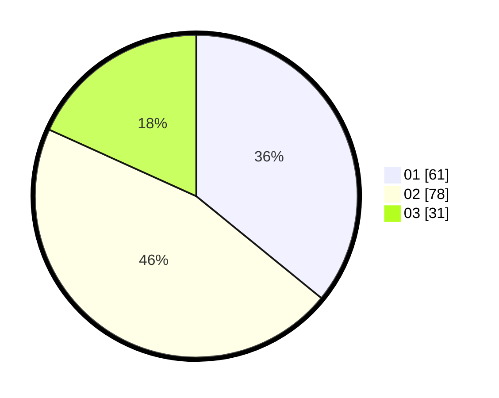

# Hasil

Hasil perolehan suara paslon dapat dilihat pada file paslon-01.txt, paslon-02.txt, dan paslon-03.txt.

Jika tidak ada, artinya data tersebut belum ada pada SIREKAP.

## Perolehan Suara

 * Paslon 01: **61**.
 * Paslon 02: **78**.
 * Paslon 03: **31**.

## Foto C Plano

https://sirekap-obj-formc.kpu.go.id/bb41/pemilu/ppwp/31/73/07/10/04/3173071004092-20240214-223835--b773f551-f84c-45de-8776-f71c50f472fd.jpg

https://sirekap-obj-formc.kpu.go.id/bb41/pemilu/ppwp/31/73/07/10/04/3173071004092-20240214-223035--8d2f470a-d1c7-4cfe-829e-5edab31be0cd.jpg

https://sirekap-obj-formc.kpu.go.id/bb41/pemilu/ppwp/31/73/07/10/04/3173071004092-20240214-223106--c43f36f0-5b81-4f54-9edf-43253aa4c218.jpg
