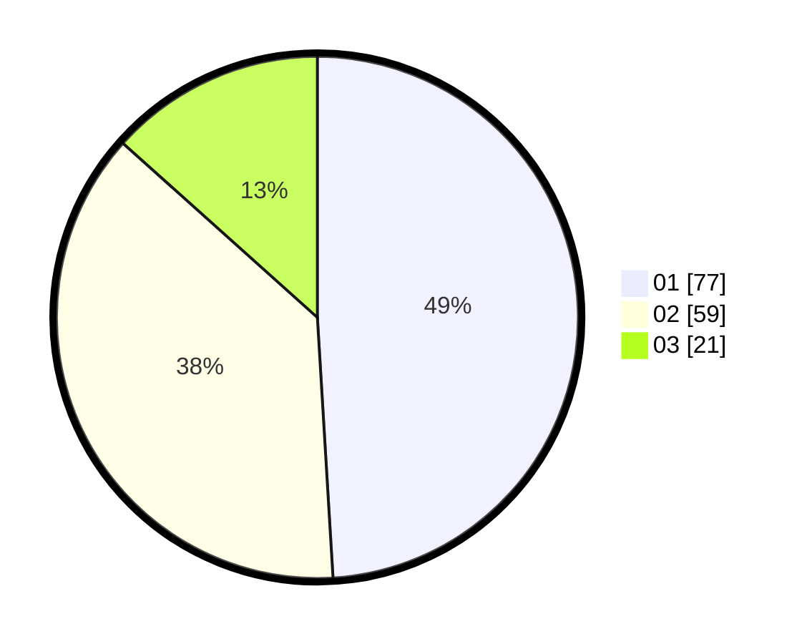

# Hasil

Hasil perolehan suara paslon dapat dilihat pada file paslon-01.txt, paslon-02.txt, dan paslon-03.txt.

Jika tidak ada, artinya data tersebut belum ada pada SIREKAP.

## Perolehan Suara

 * Paslon 01: **77**.
 * Paslon 02: **59**.
 * Paslon 03: **21**.

## Foto C Plano

https://sirekap-obj-formc.kpu.go.id/2255/pemilu/ppwp/31/73/07/10/04/3173071004093-20240214-210709--86ae4440-4a1c-4509-8b61-ea960ece29b3.jpg

https://sirekap-obj-formc.kpu.go.id/2255/pemilu/ppwp/31/73/07/10/04/3173071004093-20240214-210807--14b7d82d-eff8-4604-9877-df8cefce964d.jpg

https://sirekap-obj-formc.kpu.go.id/2255/pemilu/ppwp/31/73/07/10/04/3173071004093-20240214-210847--0c6edd81-9fca-4f25-bf66-9e4be9b7edcb.jpg
