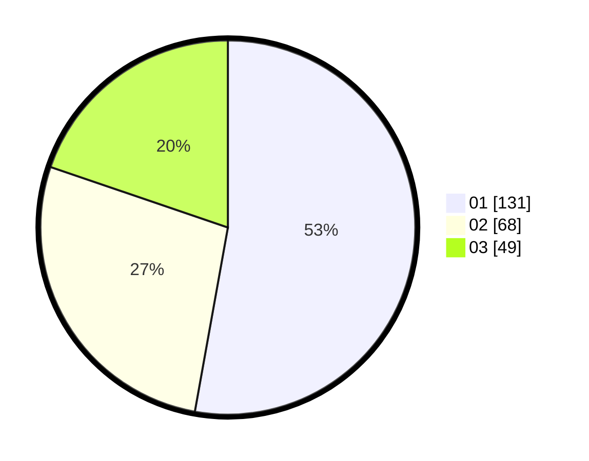

# Hasil

Hasil perolehan suara paslon dapat dilihat pada file paslon-01.txt, paslon-02.txt, dan paslon-03.txt.

Jika tidak ada, artinya data tersebut belum ada pada SIREKAP.

## Perolehan Suara

 * Paslon 01: **131**.
 * Paslon 02: **68**.
 * Paslon 03: **49**.

## Foto C Plano

https://sirekap-obj-formc.kpu.go.id/08e3/pemilu/ppwp/31/73/07/10/05/3173071005001-20240214-214648--514d4e7b-3cfa-49b0-b666-37cb6abe6bf7.jpg

https://sirekap-obj-formc.kpu.go.id/08e3/pemilu/ppwp/31/73/07/10/05/3173071005001-20240214-214720--fd3b3ce6-d7f8-474e-8837-432191e9ec84.jpg

https://sirekap-obj-formc.kpu.go.id/08e3/pemilu/ppwp/31/73/07/10/05/3173071005001-20240214-214754--f73f0745-9360-42d3-81c3-43b0c1a140f3.jpg
