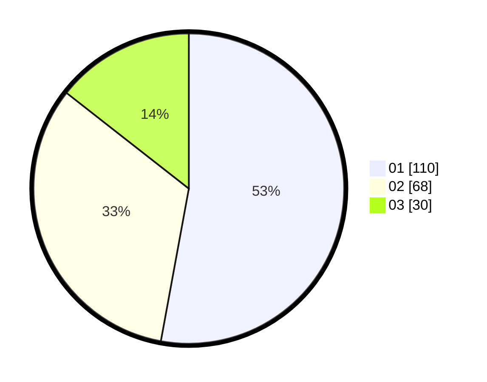

# Hasil

Hasil perolehan suara paslon dapat dilihat pada file paslon-01.txt, paslon-02.txt, dan paslon-03.txt.

Jika tidak ada, artinya data tersebut belum ada pada SIREKAP.

## Perolehan Suara

 * Paslon 01: **110**.
 * Paslon 02: **68**.
 * Paslon 03: **30**.

## Foto C Plano

https://sirekap-obj-formc.kpu.go.id/17b8/pemilu/ppwp/31/73/07/10/05/3173071005003-20240214-210717--14b2ba08-06bb-425b-8d48-d1cc8703acbd.jpg

https://sirekap-obj-formc.kpu.go.id/17b8/pemilu/ppwp/31/73/07/10/05/3173071005003-20240214-210822--b0f78b8a-cdbe-4f43-abf1-f144e0ce8d69.jpg

https://sirekap-obj-formc.kpu.go.id/17b8/pemilu/ppwp/31/73/07/10/05/3173071005003-20240214-212209--75b8ebe3-bf6f-4539-ba1c-375f4134e34a.jpg

## DATA PEMILIH TETAP

Jumlah pemilih dalam DPT: **254**.
 * L: **123**.
 * P: **131**.

## DATA PENGGUNA HAK PILIH

Jumlah pengguna hak pilih dalam DPT: **193**.
 * L: **91**.
 * P: **102**.

Jumlah pengguna hak pilih dalam DPTb: **16**.
 * L: **8**.
 * P: **8**.

Jumlah pengguna hak pilih dalam DPK: **2**.
 * L: **1**.
 * P: **1**.

Jumlah pengguna hak pilih: **211**.
 * L: **100**.
 * P: **111**.

## JUMLAH SUARA SAH DAN TIDAK SAH

JUMLAH SELURUH SUARA SAH: **208**.

JUMLAH SUARA TIDAK SAH: **3**.

JUMLAH SELURUH SUARA SAH DAN SUARA TIDAK SAH: **211**.
