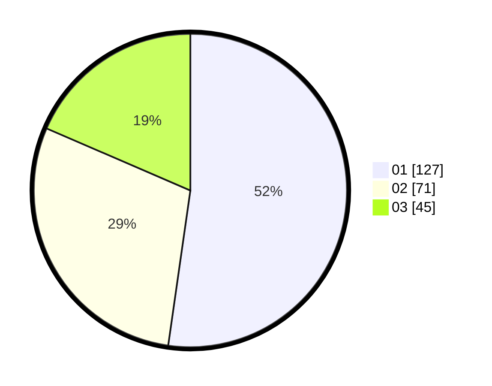

# Hasil

Hasil perolehan suara paslon dapat dilihat pada file paslon-01.txt, paslon-02.txt, dan paslon-03.txt.

Jika tidak ada, artinya data tersebut belum ada pada SIREKAP.

## Perolehan Suara

 * Paslon 01: **127**.
 * Paslon 02: **71**.
 * Paslon 03: **45**.

## Foto C Plano

https://sirekap-obj-formc.kpu.go.id/898d/pemilu/ppwp/31/73/07/10/05/3173071005005-20240214-195759--e30a1304-546a-417c-a26c-4263d68def9d.jpg

https://sirekap-obj-formc.kpu.go.id/898d/pemilu/ppwp/31/73/07/10/05/3173071005005-20240214-195611--cdb0a7d1-25b4-4798-bddb-d8cfdbec636f.jpg

https://sirekap-obj-formc.kpu.go.id/898d/pemilu/ppwp/31/73/07/10/05/3173071005005-20240214-192852--ce27704a-d2d1-4d86-9faa-8d5e5f5f7318.jpg

## DATA PEMILIH TETAP

Jumlah pemilih dalam DPT: **291**.
 * L: **137**.
 * P: **154**.

## DATA PENGGUNA HAK PILIH

Jumlah pengguna hak pilih dalam DPT: **233**.
 * L: **104**.
 * P: **129**.

Jumlah pengguna hak pilih dalam DPTb: **11**.
 * L: **3**.
 * P: **8**.

Jumlah pengguna hak pilih dalam DPK: **3**.
 * L: **0**.
 * P: **3**.

Jumlah pengguna hak pilih: **247**.
 * L: **107**.
 * P: **140**.

## JUMLAH SUARA SAH DAN TIDAK SAH

JUMLAH SELURUH SUARA SAH: **243**.

JUMLAH SUARA TIDAK SAH: **4**.

JUMLAH SELURUH SUARA SAH DAN SUARA TIDAK SAH: **247**.
