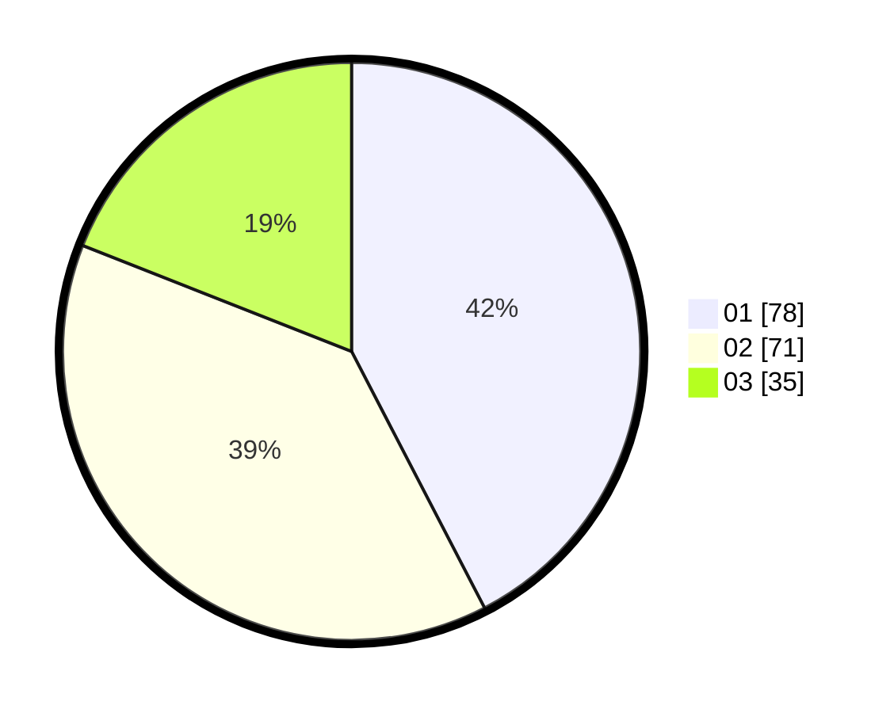

# Hasil

Hasil perolehan suara paslon dapat dilihat pada file paslon-01.txt, paslon-02.txt, dan paslon-03.txt.

Jika tidak ada, artinya data tersebut belum ada pada SIREKAP.

## Perolehan Suara

 * Paslon 01: **78**.
 * Paslon 02: **71**.
 * Paslon 03: **35**.

## Foto C Plano

https://sirekap-obj-formc.kpu.go.id/2c0f/pemilu/ppwp/31/73/07/10/05/3173071005007-20240214-230559--fe806765-9d74-4afa-8046-dbf92fe3bb1d.jpg

https://sirekap-obj-formc.kpu.go.id/2c0f/pemilu/ppwp/31/73/07/10/05/3173071005007-20240214-230646--19e6460c-d57b-426b-9b2c-acfc8691c608.jpg

https://sirekap-obj-formc.kpu.go.id/2c0f/pemilu/ppwp/31/73/07/10/05/3173071005007-20240214-230732--9e813fb7-5f8d-4ad7-8a60-97a905ab8b23.jpg
