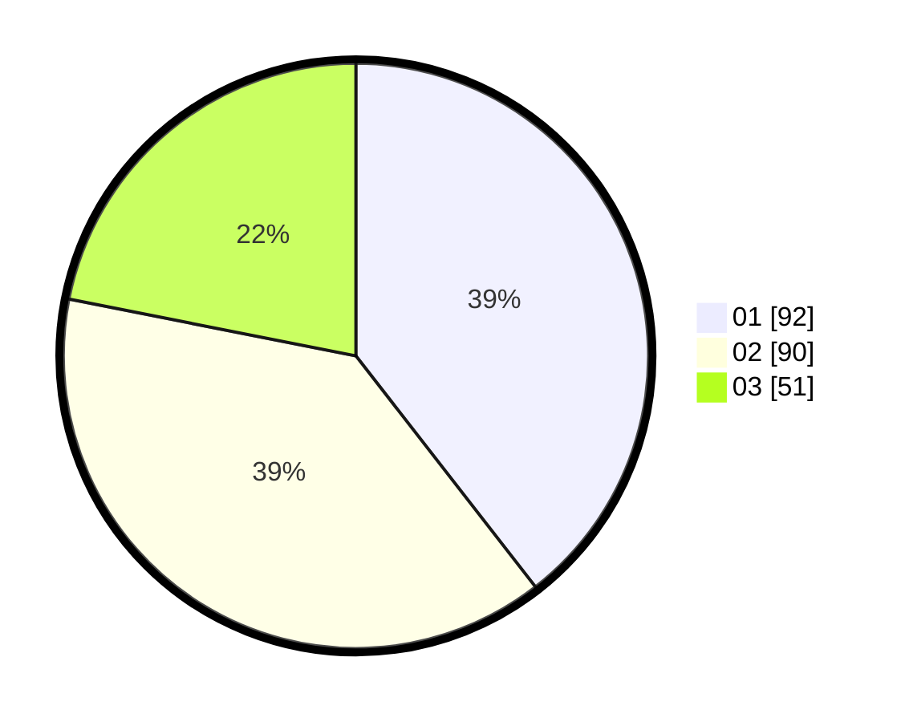

# Hasil

Hasil perolehan suara paslon dapat dilihat pada file paslon-01.txt, paslon-02.txt, dan paslon-03.txt.

Jika tidak ada, artinya data tersebut belum ada pada SIREKAP.

## Perolehan Suara

 * Paslon 01: **92**.
 * Paslon 02: **90**.
 * Paslon 03: **51**.

## Foto C Plano

https://sirekap-obj-formc.kpu.go.id/7a52/pemilu/ppwp/31/73/07/10/05/3173071005012-20240215-010541--59637428-5210-4543-b96f-a0fa91049732.jpg

https://sirekap-obj-formc.kpu.go.id/7a52/pemilu/ppwp/31/73/07/10/05/3173071005012-20240215-013824--537c68af-6778-40f0-825a-b53f5e47706e.jpg

https://sirekap-obj-formc.kpu.go.id/7a52/pemilu/ppwp/31/73/07/10/05/3173071005012-20240215-014004--77a1e264-77f0-4f74-b387-866a79eca83b.jpg
