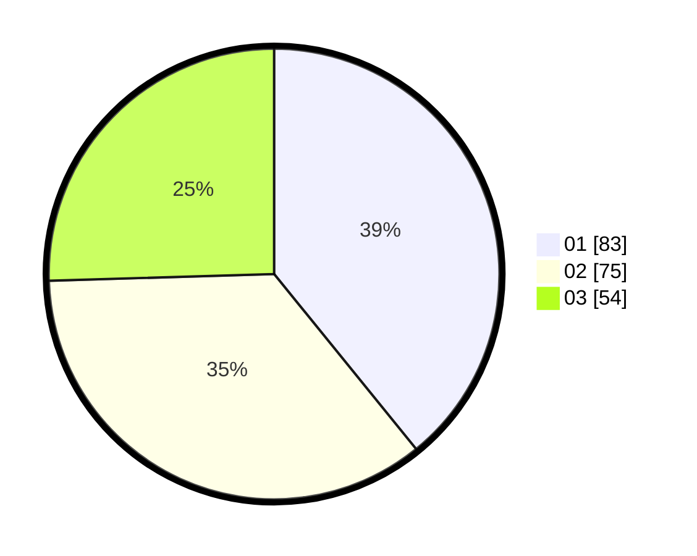

# Hasil

Hasil perolehan suara paslon dapat dilihat pada file paslon-01.txt, paslon-02.txt, dan paslon-03.txt.

Jika tidak ada, artinya data tersebut belum ada pada SIREKAP.

## Perolehan Suara

 * Paslon 01: **83**.
 * Paslon 02: **75**.
 * Paslon 03: **54**.

## Foto C Plano

https://sirekap-obj-formc.kpu.go.id/9e21/pemilu/ppwp/31/73/07/10/05/3173071005013-20240214-204104--e4189b3a-d12b-4dcc-a26b-1aaa2c24124d.jpg

https://sirekap-obj-formc.kpu.go.id/9e21/pemilu/ppwp/31/73/07/10/05/3173071005013-20240214-204150--784d11aa-192b-44c6-9165-85022a72ac92.jpg

https://sirekap-obj-formc.kpu.go.id/9e21/pemilu/ppwp/31/73/07/10/05/3173071005013-20240214-204236--6db9b0de-595d-4382-9378-f60f9b94c73d.jpg
