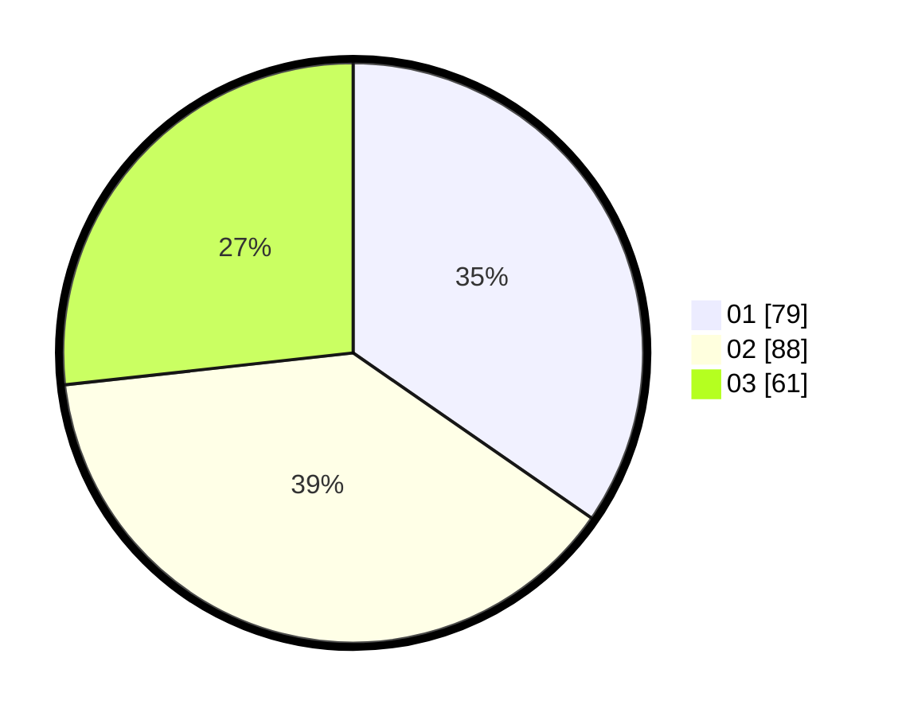

# Hasil

Hasil perolehan suara paslon dapat dilihat pada file paslon-01.txt, paslon-02.txt, dan paslon-03.txt.

Jika tidak ada, artinya data tersebut belum ada pada SIREKAP.

## Perolehan Suara

 * Paslon 01: **79**.
 * Paslon 02: **88**.
 * Paslon 03: **61**.

## Foto C Plano

https://sirekap-obj-formc.kpu.go.id/8265/pemilu/ppwp/31/73/07/10/05/3173071005014-20240214-185118--5298870a-9828-4a5a-bf2a-5c13ee2433e9.jpg

https://sirekap-obj-formc.kpu.go.id/8265/pemilu/ppwp/31/73/07/10/05/3173071005014-20240214-185126--6729bd2d-1020-4dcf-9ee9-5d379ba8b106.jpg

https://sirekap-obj-formc.kpu.go.id/8265/pemilu/ppwp/31/73/07/10/05/3173071005014-20240214-185130--60e05af1-8353-4d0b-be3b-1b3db0fbb145.jpg

## DATA PEMILIH TETAP

Jumlah pemilih dalam DPT: **264**.
 * L: **131**.
 * P: **133**.

## DATA PENGGUNA HAK PILIH

Jumlah pengguna hak pilih dalam DPT: **211**.
 * L: **104**.
 * P: **107**.

Jumlah pengguna hak pilih dalam DPTb: **19**.
 * L: **9**.
 * P: **10**.

Jumlah pengguna hak pilih dalam DPK: **0**.
 * L: **0**.
 * P: **0**.

Jumlah pengguna hak pilih: **230**.
 * L: **0**.
 * P: **0**.

## JUMLAH SUARA SAH DAN TIDAK SAH

JUMLAH SELURUH SUARA SAH: **228**.

JUMLAH SUARA TIDAK SAH: **2**.

JUMLAH SELURUH SUARA SAH DAN SUARA TIDAK SAH: **230**.
