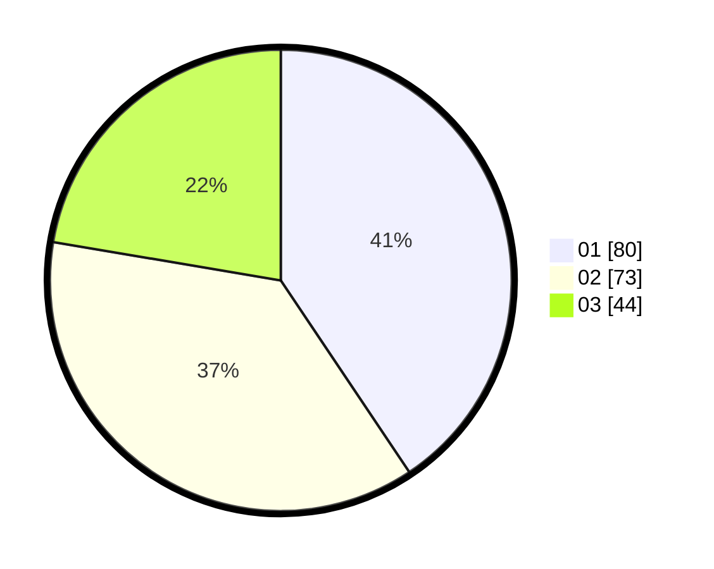

# Hasil

Hasil perolehan suara paslon dapat dilihat pada file paslon-01.txt, paslon-02.txt, dan paslon-03.txt.

Jika tidak ada, artinya data tersebut belum ada pada SIREKAP.

## Perolehan Suara

 * Paslon 01: **80**.
 * Paslon 02: **73**.
 * Paslon 03: **44**.

## Foto C Plano

https://sirekap-obj-formc.kpu.go.id/e9a1/pemilu/ppwp/31/73/07/10/05/3173071005019-20240214-234911--7af2f975-0a8b-420f-a7f8-202a9b711fbe.jpg

https://sirekap-obj-formc.kpu.go.id/e9a1/pemilu/ppwp/31/73/07/10/05/3173071005019-20240214-235008--9dcae6fa-ff7e-4a24-91d9-48af341e91aa.jpg

https://sirekap-obj-formc.kpu.go.id/e9a1/pemilu/ppwp/31/73/07/10/05/3173071005019-20240214-235028--d328dcb3-d7ad-4a00-9868-72bdee46ae3f.jpg

## DATA PEMILIH TETAP

Jumlah pemilih dalam DPT: **280**.
 * L: **131**.
 * P: **149**.

## DATA PENGGUNA HAK PILIH

Jumlah pengguna hak pilih dalam DPT: **194**.
 * L: **88**.
 * P: **106**.

Jumlah pengguna hak pilih dalam DPTb: **6**.
 * L: **1**.
 * P: **5**.

Jumlah pengguna hak pilih dalam DPK: **0**.
 * L: **0**.
 * P: **0**.

Jumlah pengguna hak pilih: **200**.
 * L: **89**.
 * P: **111**.

## JUMLAH SUARA SAH DAN TIDAK SAH

JUMLAH SELURUH SUARA SAH: **197**.

JUMLAH SUARA TIDAK SAH: **3**.

JUMLAH SELURUH SUARA SAH DAN SUARA TIDAK SAH: **200**.
