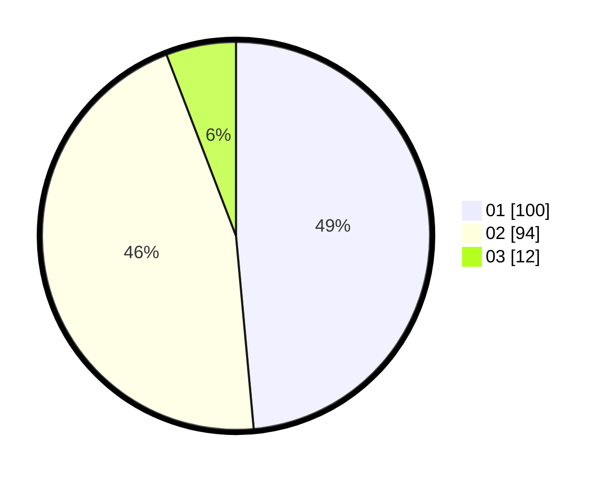

# Hasil

Hasil perolehan suara paslon dapat dilihat pada file paslon-01.txt, paslon-02.txt, dan paslon-03.txt.

Jika tidak ada, artinya data tersebut belum ada pada SIREKAP.

## Perolehan Suara

 * Paslon 01: **100**.
 * Paslon 02: **94**.
 * Paslon 03: **12**.

## Foto C Plano

https://sirekap-obj-formc.kpu.go.id/1566/pemilu/ppwp/31/73/07/10/05/3173071005023-20240215-000459--700e0228-4432-40ec-b851-c67ddab39d74.jpg

https://sirekap-obj-formc.kpu.go.id/1566/pemilu/ppwp/31/73/07/10/05/3173071005023-20240215-000617--10e96a43-c761-46e1-9a83-8d118b5335cd.jpg

https://sirekap-obj-formc.kpu.go.id/1566/pemilu/ppwp/31/73/07/10/05/3173071005023-20240215-000914--d4fcbaa6-9d81-4013-b12e-50a810eb1468.jpg

## DATA PEMILIH TETAP

Jumlah pemilih dalam DPT: **255**.
 * L: **127**.
 * P: **128**.

## DATA PENGGUNA HAK PILIH

Jumlah pengguna hak pilih dalam DPT: **199**.
 * L: **93**.
 * P: **106**.

Jumlah pengguna hak pilih dalam DPTb: **10**.
 * L: **3**.
 * P: **7**.

Jumlah pengguna hak pilih dalam DPK: **0**.
 * L: **0**.
 * P: **0**.

Jumlah pengguna hak pilih: **209**.
 * L: **96**.
 * P: **113**.

## JUMLAH SUARA SAH DAN TIDAK SAH

JUMLAH SELURUH SUARA SAH: **206**.

JUMLAH SUARA TIDAK SAH: **3**.

JUMLAH SELURUH SUARA SAH DAN SUARA TIDAK SAH: **209**.
