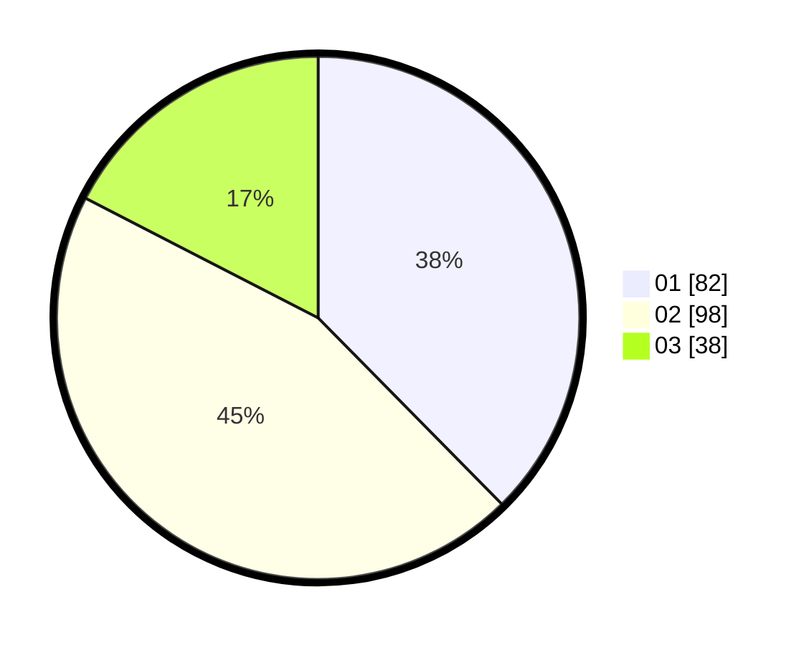

# Hasil

Hasil perolehan suara paslon dapat dilihat pada file paslon-01.txt, paslon-02.txt, dan paslon-03.txt.

Jika tidak ada, artinya data tersebut belum ada pada SIREKAP.

## Perolehan Suara

 * Paslon 01: **82**.
 * Paslon 02: **98**.
 * Paslon 03: **38**.

## Foto C Plano

https://sirekap-obj-formc.kpu.go.id/2b53/pemilu/ppwp/31/73/07/10/05/3173071005024-20240217-133926--5946851d-8caf-46c2-97f4-d1470204de14.jpg

https://sirekap-obj-formc.kpu.go.id/2b53/pemilu/ppwp/31/73/07/10/05/3173071005024-20240214-224505--e8b145da-90a1-43fa-a2e1-ee00934b1b9f.jpg

https://sirekap-obj-formc.kpu.go.id/2b53/pemilu/ppwp/31/73/07/10/05/3173071005024-20240215-030927--63e34824-ba42-4e0b-b912-2395bfe48ed1.jpg
