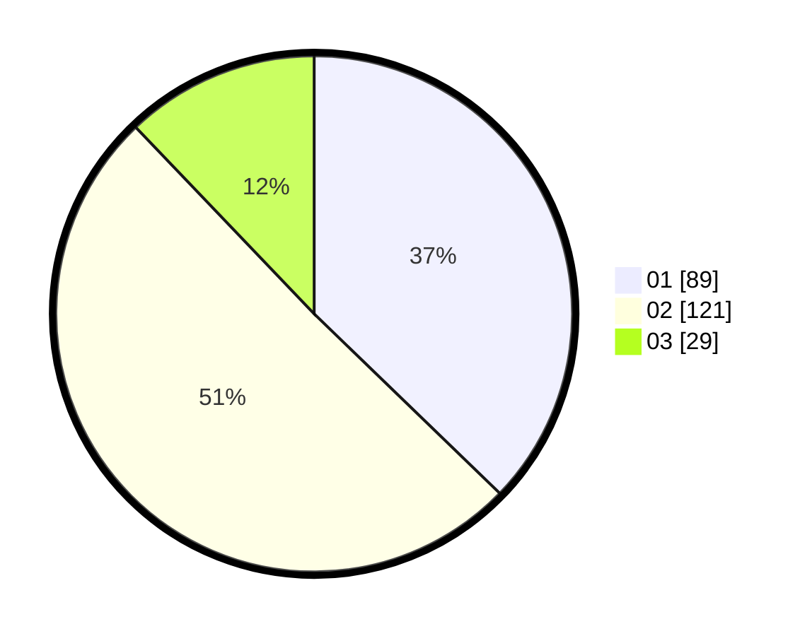

# Hasil

Hasil perolehan suara paslon dapat dilihat pada file paslon-01.txt, paslon-02.txt, dan paslon-03.txt.

Jika tidak ada, artinya data tersebut belum ada pada SIREKAP.

## Perolehan Suara

 * Paslon 01: **89**.
 * Paslon 02: **121**.
 * Paslon 03: **29**.

## Foto C Plano

https://sirekap-obj-formc.kpu.go.id/3efc/pemilu/ppwp/31/73/07/10/05/3173071005028-20240215-071621--fc8078ee-02e0-400b-a884-67e695b9d428.jpg

https://sirekap-obj-formc.kpu.go.id/3efc/pemilu/ppwp/31/73/07/10/05/3173071005028-20240215-071811--d0cf97ec-12b4-4036-a43c-0c8ef5c78bf7.jpg

https://sirekap-obj-formc.kpu.go.id/3efc/pemilu/ppwp/31/73/07/10/05/3173071005028-20240215-071952--da7a6158-6793-44c0-9501-9457fa975abf.jpg
