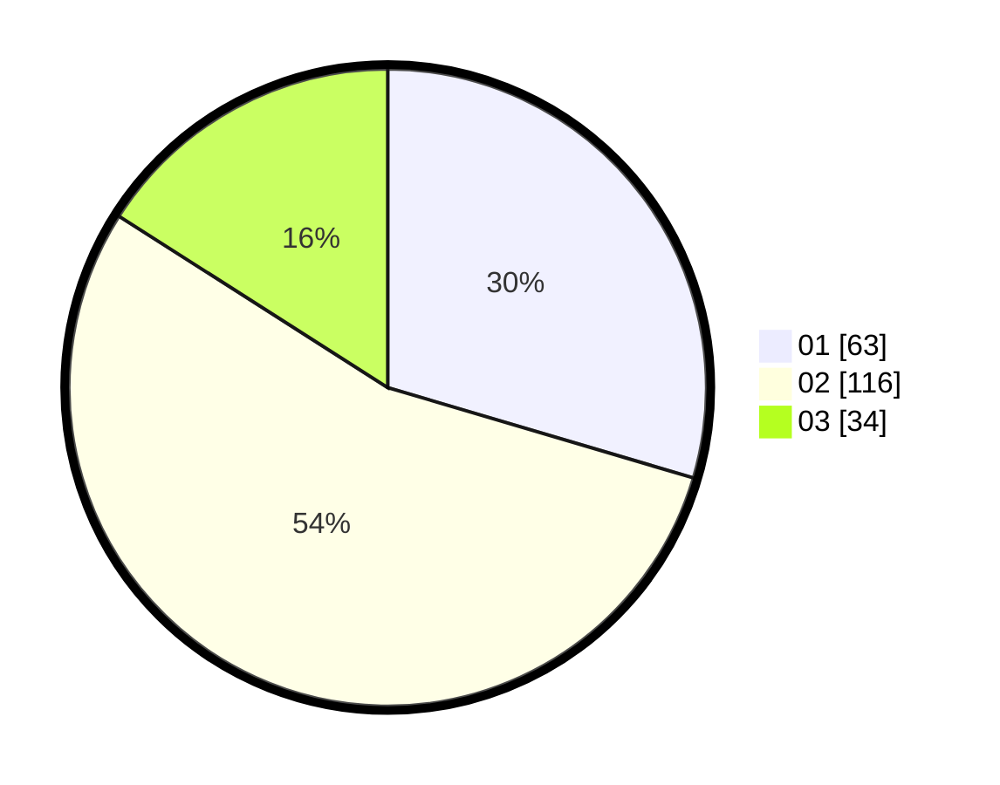

# Hasil

Hasil perolehan suara paslon dapat dilihat pada file paslon-01.txt, paslon-02.txt, dan paslon-03.txt.

Jika tidak ada, artinya data tersebut belum ada pada SIREKAP.

## Perolehan Suara

 * Paslon 01: **63**.
 * Paslon 02: **116**.
 * Paslon 03: **34**.

## Foto C Plano

https://sirekap-obj-formc.kpu.go.id/2fc9/pemilu/ppwp/31/73/07/10/05/3173071005030-20240214-175318--0f126f76-10a9-4497-8c3f-bab93049c095.jpg

https://sirekap-obj-formc.kpu.go.id/2fc9/pemilu/ppwp/31/73/07/10/05/3173071005030-20240214-175444--2a41cfdb-c4fd-485b-a75a-92745203f39d.jpg

https://sirekap-obj-formc.kpu.go.id/2fc9/pemilu/ppwp/31/73/07/10/05/3173071005030-20240214-191047--6ff1f7de-f8ba-4e20-bb96-997e273fd3c9.jpg

## DATA PEMILIH TETAP

Jumlah pemilih dalam DPT: **275**.
 * L: **133**.
 * P: **142**.

## DATA PENGGUNA HAK PILIH

Jumlah pengguna hak pilih dalam DPT: **213**.
 * L: **101**.
 * P: **112**.

Jumlah pengguna hak pilih dalam DPTb: **1**.
 * L: **1**.
 * P: **0**.

Jumlah pengguna hak pilih dalam DPK: **2**.
 * L: **1**.
 * P: **1**.

Jumlah pengguna hak pilih: **216**.
 * L: **103**.
 * P: **113**.

## JUMLAH SUARA SAH DAN TIDAK SAH

JUMLAH SELURUH SUARA SAH: **213**.

JUMLAH SUARA TIDAK SAH: **3**.

JUMLAH SELURUH SUARA SAH DAN SUARA TIDAK SAH: **216**.
