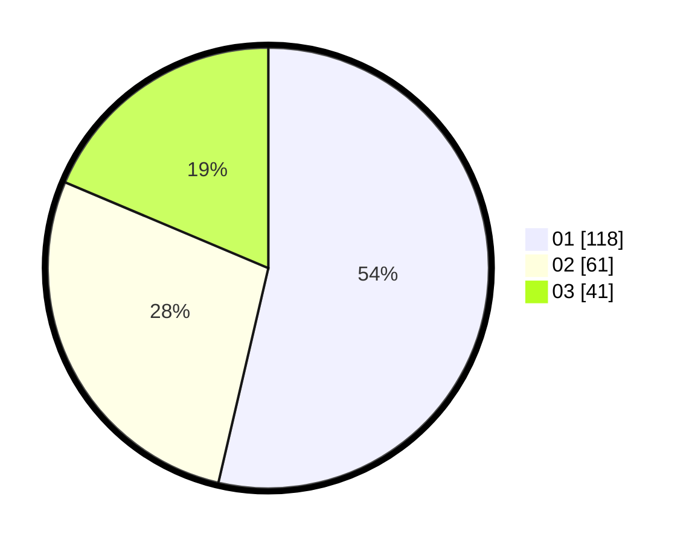

# Hasil

Hasil perolehan suara paslon dapat dilihat pada file paslon-01.txt, paslon-02.txt, dan paslon-03.txt.

Jika tidak ada, artinya data tersebut belum ada pada SIREKAP.

## Perolehan Suara

 * Paslon 01: **118**.
 * Paslon 02: **61**.
 * Paslon 03: **41**.

## Foto C Plano

https://sirekap-obj-formc.kpu.go.id/6ad5/pemilu/ppwp/31/73/07/10/05/3173071005037-20240214-155915--d68f41fd-6b45-4d74-ba0a-f86bca31d1d2.jpg

https://sirekap-obj-formc.kpu.go.id/6ad5/pemilu/ppwp/31/73/07/10/05/3173071005037-20240214-160058--71e851e8-0006-48cc-82c9-b046467c60c1.jpg

https://sirekap-obj-formc.kpu.go.id/6ad5/pemilu/ppwp/31/73/07/10/05/3173071005037-20240214-200727--88416840-9eef-4920-872e-8d406f9f33c6.jpg
