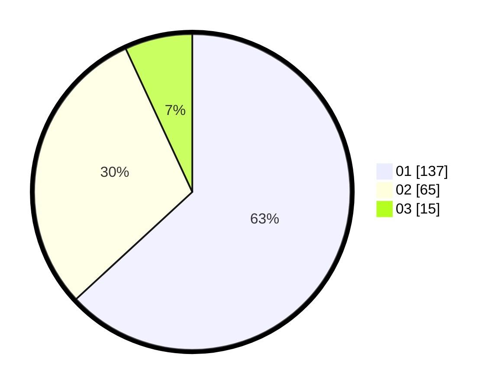

# Hasil

Hasil perolehan suara paslon dapat dilihat pada file paslon-01.txt, paslon-02.txt, dan paslon-03.txt.

Jika tidak ada, artinya data tersebut belum ada pada SIREKAP.

## Perolehan Suara

 * Paslon 01: **137**.
 * Paslon 02: **65**.
 * Paslon 03: **15**.

## Foto C Plano

https://sirekap-obj-formc.kpu.go.id/afbe/pemilu/ppwp/31/73/07/10/05/3173071005049-20240215-175505--dc05ce76-6641-469c-b6a6-3be06a69b713.jpg

https://sirekap-obj-formc.kpu.go.id/afbe/pemilu/ppwp/31/73/07/10/05/3173071005049-20240215-175611--2a7db80e-978d-471c-bcf5-c5e35aa92dc0.jpg

https://sirekap-obj-formc.kpu.go.id/afbe/pemilu/ppwp/31/73/07/10/05/3173071005049-20240215-175601--85d8dd74-447c-492c-9986-6f6e36ff653a.jpg
