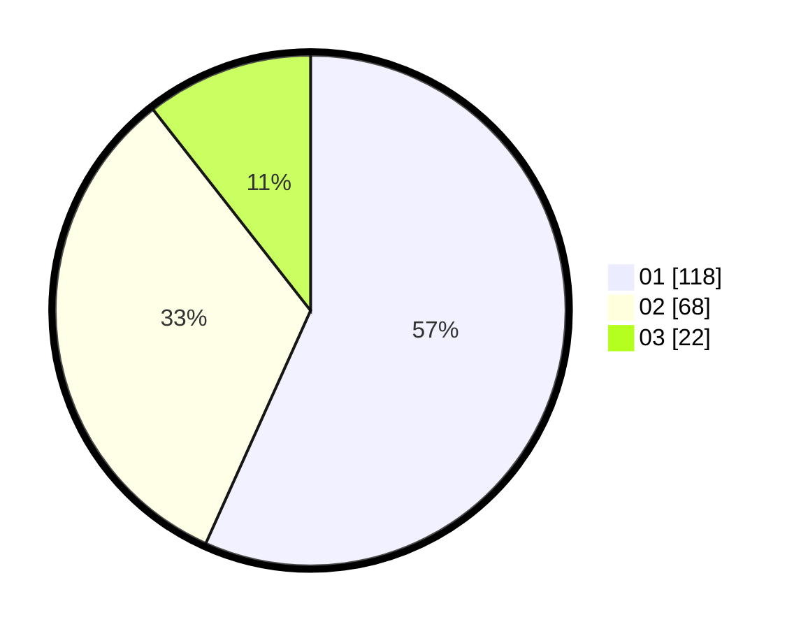

# Hasil

Hasil perolehan suara paslon dapat dilihat pada file paslon-01.txt, paslon-02.txt, dan paslon-03.txt.

Jika tidak ada, artinya data tersebut belum ada pada SIREKAP.

## Perolehan Suara

 * Paslon 01: **118**.
 * Paslon 02: **68**.
 * Paslon 03: **22**.

## Foto C Plano

https://sirekap-obj-formc.kpu.go.id/f32c/pemilu/ppwp/31/73/07/10/05/3173071005050-20240214-232811--c0379fb8-f711-4174-ae15-40b103324274.jpg

https://sirekap-obj-formc.kpu.go.id/f32c/pemilu/ppwp/31/73/07/10/05/3173071005050-20240214-233330--a77383a9-d315-4995-9534-1c7c3163c1fa.jpg

https://sirekap-obj-formc.kpu.go.id/f32c/pemilu/ppwp/31/73/07/10/05/3173071005050-20240214-233651--3961c031-c45c-4b39-9a2b-8c20cecd4f7b.jpg
