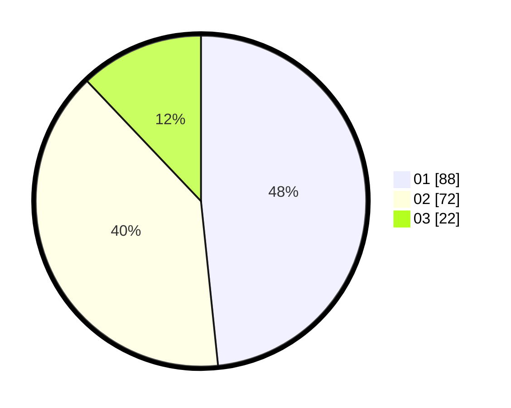

# Hasil

Hasil perolehan suara paslon dapat dilihat pada file paslon-01.txt, paslon-02.txt, dan paslon-03.txt.

Jika tidak ada, artinya data tersebut belum ada pada SIREKAP.

## Perolehan Suara

 * Paslon 01: **88**.
 * Paslon 02: **72**.
 * Paslon 03: **22**.

## Foto C Plano

https://sirekap-obj-formc.kpu.go.id/cd84/pemilu/ppwp/31/73/07/10/05/3173071005052-20240216-122420--0afcce90-e4e3-4368-9ca5-040b15364821.jpg

https://sirekap-obj-formc.kpu.go.id/cd84/pemilu/ppwp/31/73/07/10/05/3173071005052-20240216-122535--a0df719c-06aa-4e5c-ae91-1449b67341ee.jpg

https://sirekap-obj-formc.kpu.go.id/cd84/pemilu/ppwp/31/73/07/10/05/3173071005052-20240214-203923--e12a9f8e-6b4d-418f-91b1-4df9ffc27f07.jpg
