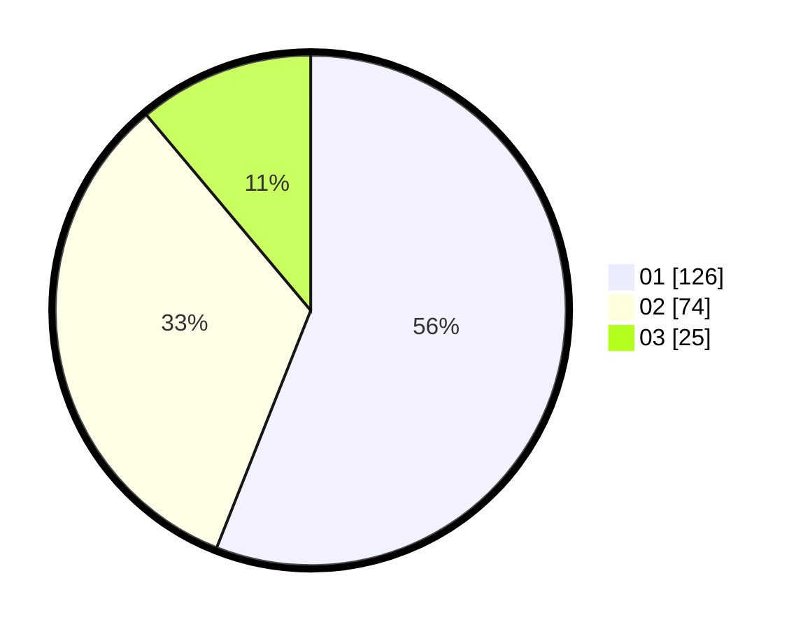

# Hasil

Hasil perolehan suara paslon dapat dilihat pada file paslon-01.txt, paslon-02.txt, dan paslon-03.txt.

Jika tidak ada, artinya data tersebut belum ada pada SIREKAP.

## Perolehan Suara

 * Paslon 01: **126**.
 * Paslon 02: **74**.
 * Paslon 03: **25**.

## Foto C Plano

https://sirekap-obj-formc.kpu.go.id/cfe9/pemilu/ppwp/31/73/07/10/05/3173071005055-20240215-031231--0dc84e6c-48a3-470f-b631-cc5affd14680.jpg

https://sirekap-obj-formc.kpu.go.id/cfe9/pemilu/ppwp/31/73/07/10/05/3173071005055-20240215-031526--1d652cae-74cb-46c2-92bd-1070d69daf56.jpg

https://sirekap-obj-formc.kpu.go.id/cfe9/pemilu/ppwp/31/73/07/10/05/3173071005055-20240215-031618--c5cab1cf-de8b-43b3-a9e9-94d617de5a77.jpg
