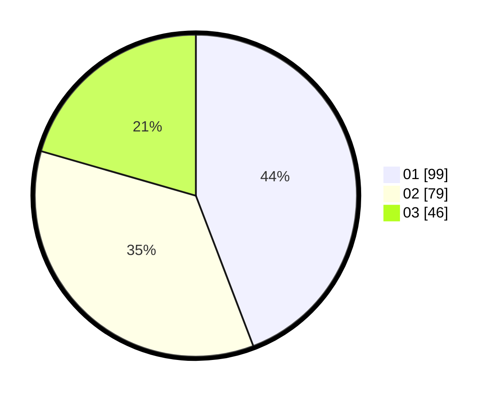

# Hasil

Hasil perolehan suara paslon dapat dilihat pada file paslon-01.txt, paslon-02.txt, dan paslon-03.txt.

Jika tidak ada, artinya data tersebut belum ada pada SIREKAP.

## Perolehan Suara

 * Paslon 01: **99**.
 * Paslon 02: **79**.
 * Paslon 03: **46**.

## Foto C Plano

https://sirekap-obj-formc.kpu.go.id/ff5d/pemilu/ppwp/31/73/07/10/05/3173071005065-20240214-214812--41401bf8-f148-42c2-839f-4ecae86571a6.jpg

https://sirekap-obj-formc.kpu.go.id/ff5d/pemilu/ppwp/31/73/07/10/05/3173071005065-20240214-232519--c5295758-67df-4dd3-95e2-41c947a4b84f.jpg

https://sirekap-obj-formc.kpu.go.id/ff5d/pemilu/ppwp/31/73/07/10/05/3173071005065-20240214-232643--c845ad26-861b-4e51-abbc-8a90b3eefc3c.jpg
