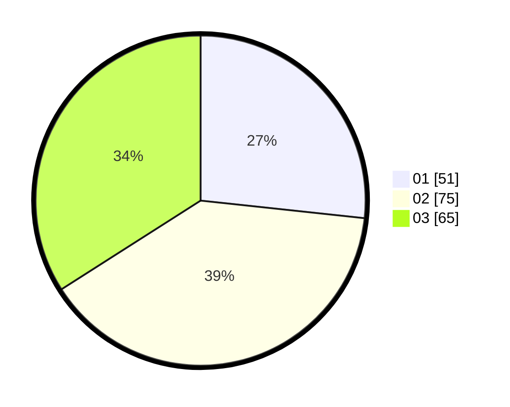

# Hasil

Hasil perolehan suara paslon dapat dilihat pada file paslon-01.txt, paslon-02.txt, dan paslon-03.txt.

Jika tidak ada, artinya data tersebut belum ada pada SIREKAP.

## Perolehan Suara

 * Paslon 01: **51**.
 * Paslon 02: **75**.
 * Paslon 03: **65**.

## Foto C Plano

https://sirekap-obj-formc.kpu.go.id/9994/pemilu/ppwp/31/73/07/10/05/3173071005066-20240215-023653--0fa2d164-4bae-400f-85b4-97eead9873b7.jpg

https://sirekap-obj-formc.kpu.go.id/9994/pemilu/ppwp/31/73/07/10/05/3173071005066-20240215-023751--30745897-f250-48d9-ad2d-8a1358f11907.jpg

https://sirekap-obj-formc.kpu.go.id/9994/pemilu/ppwp/31/73/07/10/05/3173071005066-20240215-023859--33b039fd-1afc-429b-9ee9-c385234b9048.jpg
