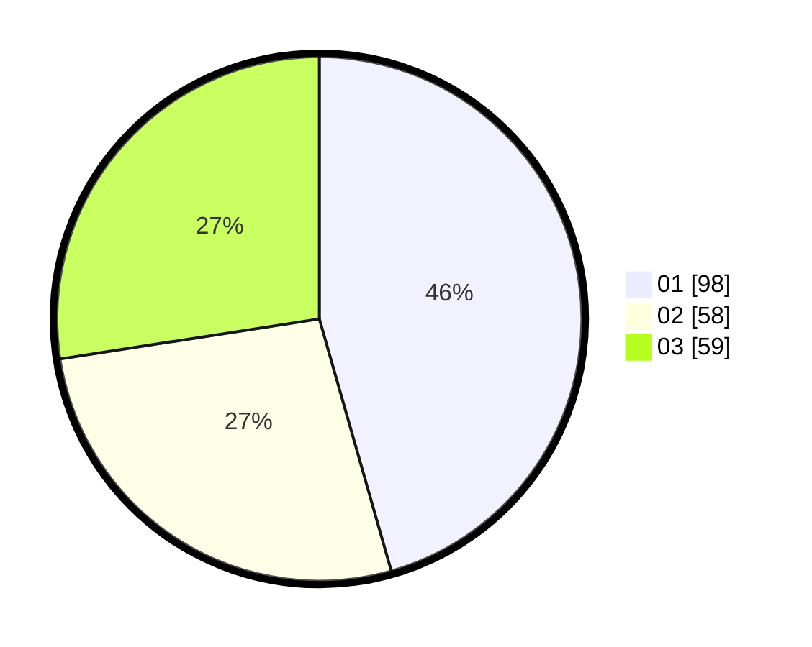

# Hasil

Hasil perolehan suara paslon dapat dilihat pada file paslon-01.txt, paslon-02.txt, dan paslon-03.txt.

Jika tidak ada, artinya data tersebut belum ada pada SIREKAP.

## Perolehan Suara

 * Paslon 01: **98**.
 * Paslon 02: **58**.
 * Paslon 03: **59**.

## Foto C Plano

https://sirekap-obj-formc.kpu.go.id/fecd/pemilu/ppwp/31/73/07/10/05/3173071005072-20240214-233136--bff1fe9c-1358-45c6-8d52-15dcfc6e0a41.jpg

https://sirekap-obj-formc.kpu.go.id/fecd/pemilu/ppwp/31/73/07/10/05/3173071005072-20240214-233444--acf39a75-483d-482c-a121-467321e64c22.jpg
