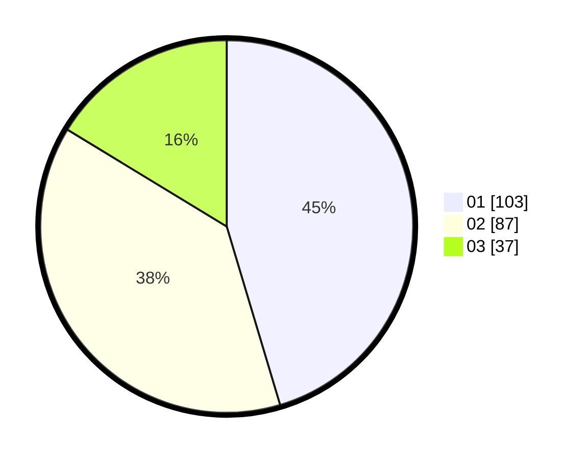

# Hasil

Hasil perolehan suara paslon dapat dilihat pada file paslon-01.txt, paslon-02.txt, dan paslon-03.txt.

Jika tidak ada, artinya data tersebut belum ada pada SIREKAP.

## Perolehan Suara

 * Paslon 01: **103**.
 * Paslon 02: **87**.
 * Paslon 03: **37**.

## Foto C Plano

https://sirekap-obj-formc.kpu.go.id/7e82/pemilu/ppwp/31/73/07/10/05/3173071005079-20240217-195522--6ba7dcfd-db2e-43ac-833f-312e770eda62.jpg

https://sirekap-obj-formc.kpu.go.id/7e82/pemilu/ppwp/31/73/07/10/05/3173071005079-20240217-013706--2a3fac08-932d-4b36-8a86-ec7c6742e398.jpg

https://sirekap-obj-formc.kpu.go.id/7e82/pemilu/ppwp/31/73/07/10/05/3173071005079-20240217-014043--70b79959-9771-4f79-be8f-6a0c11be5fa1.jpg
