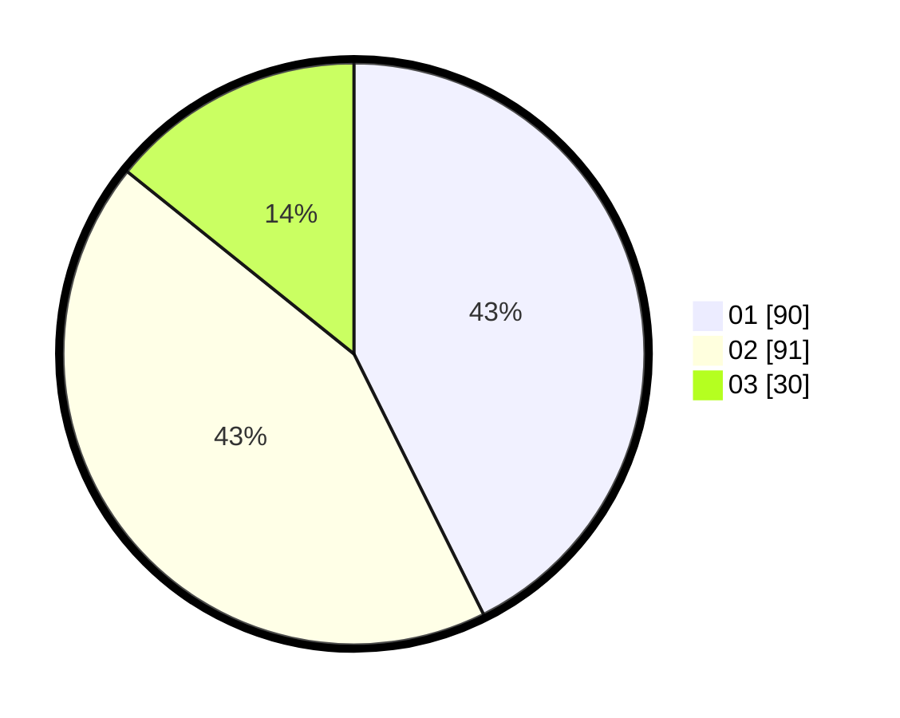

# Hasil

Hasil perolehan suara paslon dapat dilihat pada file paslon-01.txt, paslon-02.txt, dan paslon-03.txt.

Jika tidak ada, artinya data tersebut belum ada pada SIREKAP.

## Perolehan Suara

 * Paslon 01: **90**.
 * Paslon 02: **91**.
 * Paslon 03: **30**.

## Foto C Plano

https://sirekap-obj-formc.kpu.go.id/d62f/pemilu/ppwp/31/73/07/10/05/3173071005080-20240216-153646--28dd0335-f52e-4ed4-9088-095e92024181.jpg

https://sirekap-obj-formc.kpu.go.id/d62f/pemilu/ppwp/31/73/07/10/05/3173071005080-20240216-154831--e2637214-5eb6-4148-9fba-a0ae57bb0705.jpg

https://sirekap-obj-formc.kpu.go.id/d62f/pemilu/ppwp/31/73/07/10/05/3173071005080-20240216-153948--5f515aff-b033-4c31-b806-eee6b96aafba.jpg

## DATA PEMILIH TETAP

Jumlah pemilih dalam DPT: **264**.
 * L: **124**.
 * P: **140**.

## DATA PENGGUNA HAK PILIH

Jumlah pengguna hak pilih dalam DPT: **202**.
 * L: **87**.
 * P: **115**.

Jumlah pengguna hak pilih dalam DPTb: **8**.
 * L: **4**.
 * P: **4**.

Jumlah pengguna hak pilih dalam DPK: **2**.
 * L: **2**.
 * P: **0**.

Jumlah pengguna hak pilih: **212**.
 * L: **93**.
 * P: **119**.

## JUMLAH SUARA SAH DAN TIDAK SAH

JUMLAH SELURUH SUARA SAH: **211**.

JUMLAH SUARA TIDAK SAH: **1**.

JUMLAH SELURUH SUARA SAH DAN SUARA TIDAK SAH: **212**.
