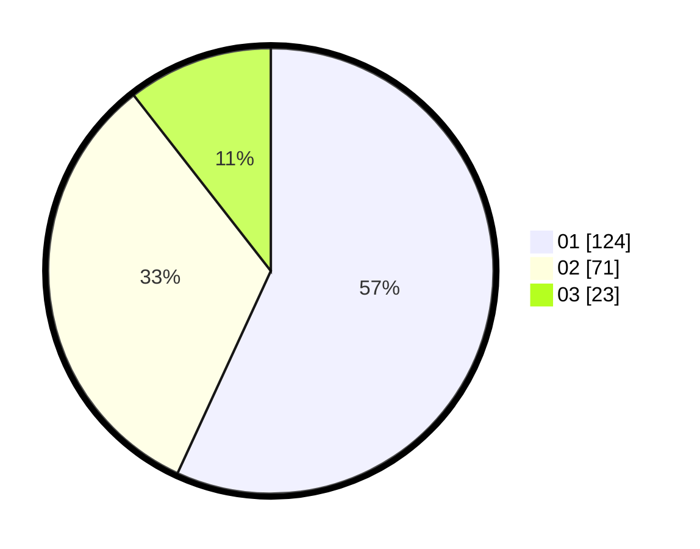

# Hasil

Hasil perolehan suara paslon dapat dilihat pada file paslon-01.txt, paslon-02.txt, dan paslon-03.txt.

Jika tidak ada, artinya data tersebut belum ada pada SIREKAP.

## Perolehan Suara

 * Paslon 01: **124**.
 * Paslon 02: **71**.
 * Paslon 03: **23**.

## Foto C Plano

https://sirekap-obj-formc.kpu.go.id/4f2f/pemilu/ppwp/31/73/07/10/05/3173071005084-20240214-214138--e402fb10-ddfa-494e-8b07-ba9667bc5ca5.jpg

https://sirekap-obj-formc.kpu.go.id/4f2f/pemilu/ppwp/31/73/07/10/05/3173071005084-20240215-005624--cae0fe6d-6b2c-46d7-b15b-f69d85c138b3.jpg

https://sirekap-obj-formc.kpu.go.id/4f2f/pemilu/ppwp/31/73/07/10/05/3173071005084-20240215-005754--a00ab3e0-0eae-4f47-ace3-aff341be8857.jpg
