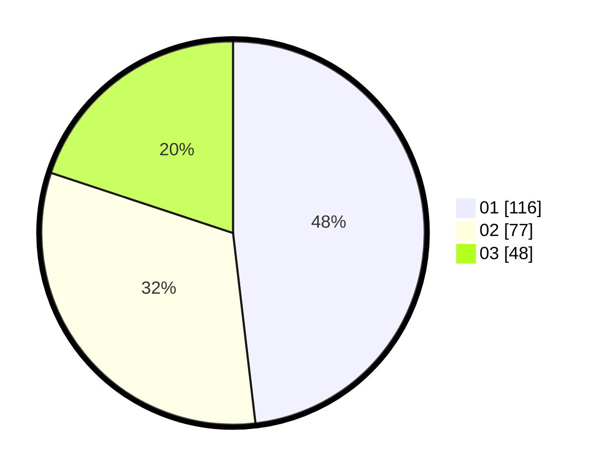

# Hasil

Hasil perolehan suara paslon dapat dilihat pada file paslon-01.txt, paslon-02.txt, dan paslon-03.txt.

Jika tidak ada, artinya data tersebut belum ada pada SIREKAP.

## Perolehan Suara

 * Paslon 01: **116**.
 * Paslon 02: **77**.
 * Paslon 03: **48**.

## Foto C Plano

https://sirekap-obj-formc.kpu.go.id/ea86/pemilu/ppwp/31/73/07/10/05/3173071005089-20240216-194008--ce53ac5d-395f-4282-a02b-e6f26f5ad853.jpg

https://sirekap-obj-formc.kpu.go.id/ea86/pemilu/ppwp/31/73/07/10/05/3173071005089-20240216-195311--23c6ecfe-85c0-4ab1-b169-f4b408adf92a.jpg

https://sirekap-obj-formc.kpu.go.id/ea86/pemilu/ppwp/31/73/07/10/05/3173071005089-20240216-194357--de8520d7-594f-4cf3-abbf-0ef76fe252c1.jpg
