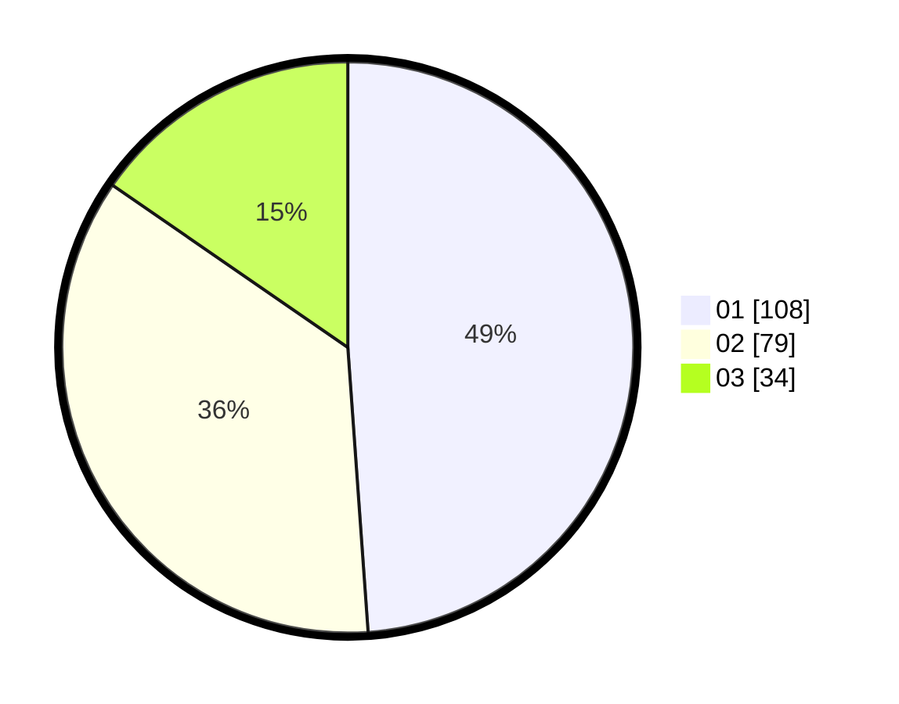

# Hasil

Hasil perolehan suara paslon dapat dilihat pada file paslon-01.txt, paslon-02.txt, dan paslon-03.txt.

Jika tidak ada, artinya data tersebut belum ada pada SIREKAP.

## Perolehan Suara

 * Paslon 01: **108**.
 * Paslon 02: **79**.
 * Paslon 03: **34**.

## Foto C Plano

https://sirekap-obj-formc.kpu.go.id/f067/pemilu/ppwp/31/73/07/10/05/3173071005094-20240214-221002--f27dea85-07ab-4448-93e4-bed234ca3923.jpg

https://sirekap-obj-formc.kpu.go.id/f067/pemilu/ppwp/31/73/07/10/05/3173071005094-20240214-200213--a4e1fc31-be3c-47ef-afa1-61aa16db187d.jpg

https://sirekap-obj-formc.kpu.go.id/f067/pemilu/ppwp/31/73/07/10/05/3173071005094-20240214-223756--10655a4a-a5b6-4243-bdbf-6faceef6bb4d.jpg

## DATA PEMILIH TETAP

Jumlah pemilih dalam DPT: **279**.
 * L: **142**.
 * P: **137**.

## DATA PENGGUNA HAK PILIH

Jumlah pengguna hak pilih dalam DPT: **207**.
 * L: **97**.
 * P: **110**.

Jumlah pengguna hak pilih dalam DPTb: **14**.
 * L: **7**.
 * P: **7**.

Jumlah pengguna hak pilih dalam DPK: **0**.
 * L: **0**.
 * P: **0**.

Jumlah pengguna hak pilih: **221**.
 * L: **104**.
 * P: **117**.

## JUMLAH SUARA SAH DAN TIDAK SAH

JUMLAH SELURUH SUARA SAH: **220**.

JUMLAH SUARA TIDAK SAH: **1**.

JUMLAH SELURUH SUARA SAH DAN SUARA TIDAK SAH: **221**.
