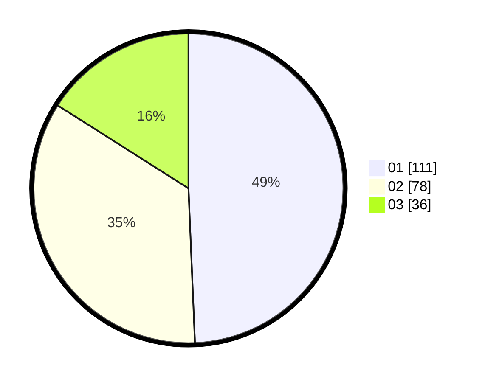

# Hasil

Hasil perolehan suara paslon dapat dilihat pada file paslon-01.txt, paslon-02.txt, dan paslon-03.txt.

Jika tidak ada, artinya data tersebut belum ada pada SIREKAP.

## Perolehan Suara

 * Paslon 01: **111**.
 * Paslon 02: **78**.
 * Paslon 03: **36**.

## Foto C Plano

https://sirekap-obj-formc.kpu.go.id/85c0/pemilu/ppwp/31/73/07/10/05/3173071005100-20240214-233633--91dd4d78-7525-4d7a-b866-a7057b79e374.jpg

https://sirekap-obj-formc.kpu.go.id/85c0/pemilu/ppwp/31/73/07/10/05/3173071005100-20240214-204913--86dda480-cb7a-44ec-a93b-00cfac4c167d.jpg

https://sirekap-obj-formc.kpu.go.id/85c0/pemilu/ppwp/31/73/07/10/05/3173071005100-20240214-233739--4c980bee-420d-442c-ab65-37734ad1b42d.jpg
