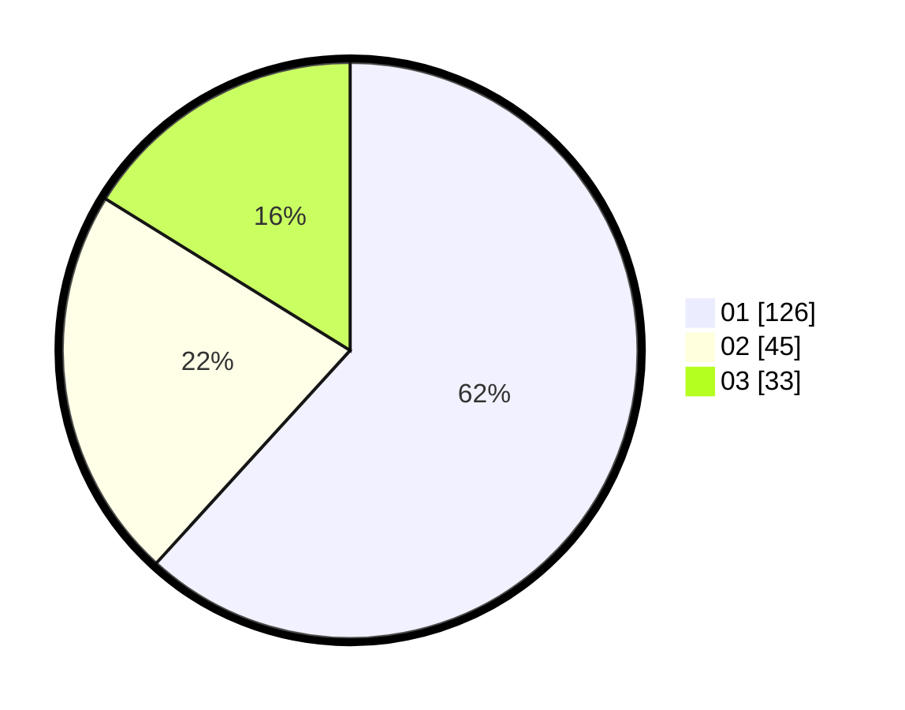

# Hasil

Hasil perolehan suara paslon dapat dilihat pada file paslon-01.txt, paslon-02.txt, dan paslon-03.txt.

Jika tidak ada, artinya data tersebut belum ada pada SIREKAP.

## Perolehan Suara

 * Paslon 01: **126**.
 * Paslon 02: **45**.
 * Paslon 03: **33**.

## Foto C Plano

https://sirekap-obj-formc.kpu.go.id/1896/pemilu/ppwp/31/73/07/10/05/3173071005104-20240215-000733--572bfc21-2a7f-4a2c-bce8-ef6f56670172.jpg

https://sirekap-obj-formc.kpu.go.id/1896/pemilu/ppwp/31/73/07/10/05/3173071005104-20240215-000900--6f0d0aae-abb9-46a0-8ced-c9e10053b4e3.jpg

https://sirekap-obj-formc.kpu.go.id/1896/pemilu/ppwp/31/73/07/10/05/3173071005104-20240215-000818--fdc0e3e3-6c22-4576-9e9c-8f197b13a52a.jpg
