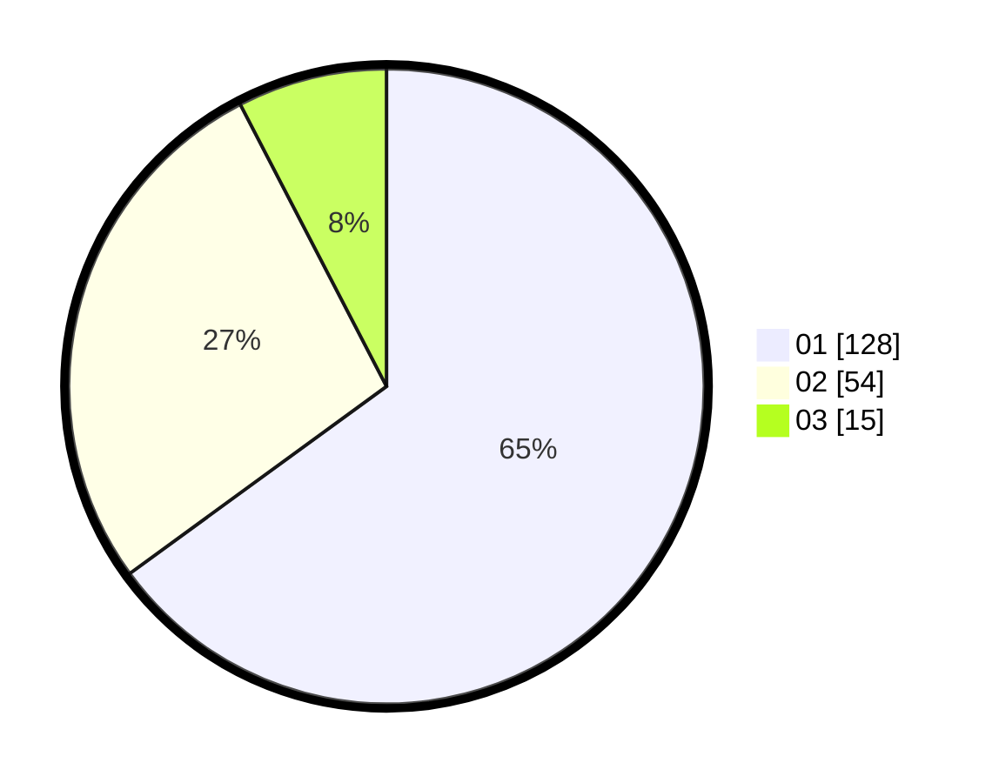

# Hasil

Hasil perolehan suara paslon dapat dilihat pada file paslon-01.txt, paslon-02.txt, dan paslon-03.txt.

Jika tidak ada, artinya data tersebut belum ada pada SIREKAP.

## Perolehan Suara

 * Paslon 01: **128**.
 * Paslon 02: **54**.
 * Paslon 03: **15**.

## Foto C Plano

https://sirekap-obj-formc.kpu.go.id/c9fe/pemilu/ppwp/31/73/07/10/05/3173071005106-20240214-214112--baf5d69a-055d-4f79-9e2d-b0771f3a3530.jpg

https://sirekap-obj-formc.kpu.go.id/c9fe/pemilu/ppwp/31/73/07/10/05/3173071005106-20240214-214134--df39ecb5-1458-4bfd-9fdd-e568ac746d90.jpg

https://sirekap-obj-formc.kpu.go.id/c9fe/pemilu/ppwp/31/73/07/10/05/3173071005106-20240214-214237--ecb14ce5-a67f-4cc0-8a8f-ef3cac570be7.jpg
