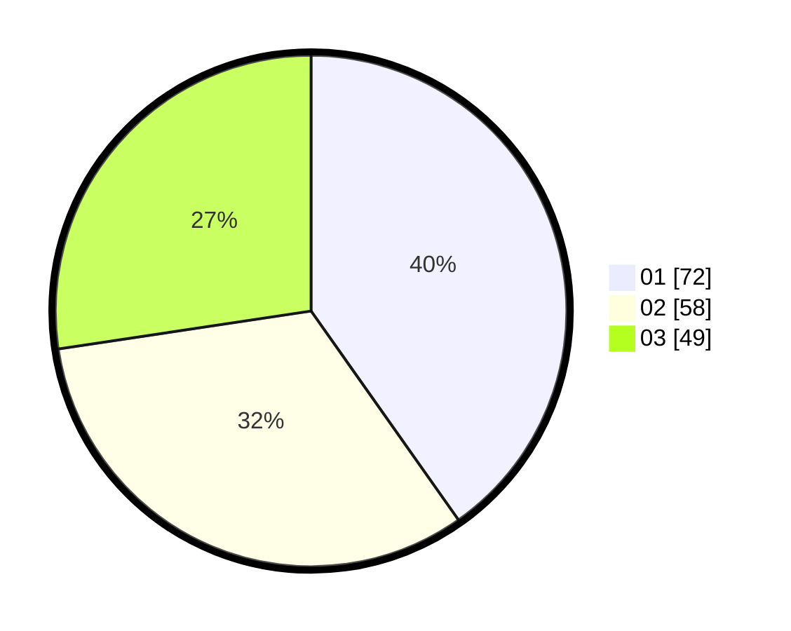

# Hasil

Hasil perolehan suara paslon dapat dilihat pada file paslon-01.txt, paslon-02.txt, dan paslon-03.txt.

Jika tidak ada, artinya data tersebut belum ada pada SIREKAP.

## Perolehan Suara

 * Paslon 01: **72**.
 * Paslon 02: **58**.
 * Paslon 03: **49**.

## Foto C Plano

https://sirekap-obj-formc.kpu.go.id/0366/pemilu/ppwp/31/73/07/10/05/3173071005108-20240214-221502--4081c284-d552-49c0-81b3-50cafbc98e7f.jpg

https://sirekap-obj-formc.kpu.go.id/0366/pemilu/ppwp/31/73/07/10/05/3173071005108-20240214-205457--592a9ec3-fcb8-4f0b-b756-a19ef93b826e.jpg

https://sirekap-obj-formc.kpu.go.id/0366/pemilu/ppwp/31/73/07/10/05/3173071005108-20240214-205833--a7fdaa02-0b9c-49eb-9c43-390fcc04b8ab.jpg
