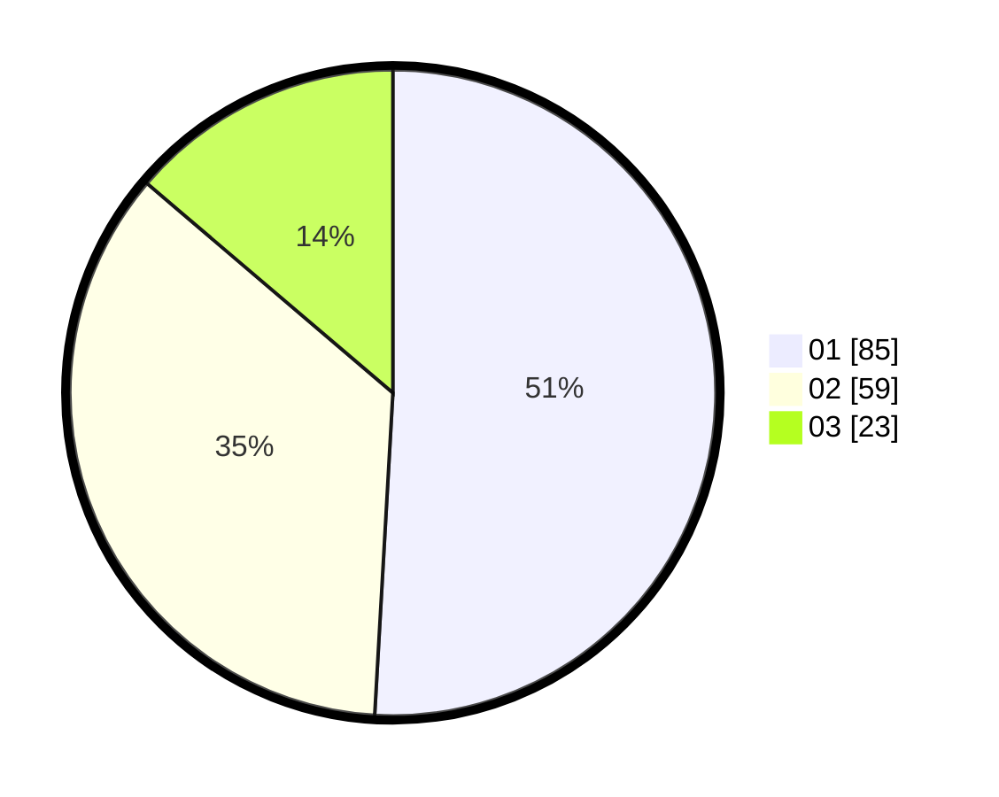

# Hasil

Hasil perolehan suara paslon dapat dilihat pada file paslon-01.txt, paslon-02.txt, dan paslon-03.txt.

Jika tidak ada, artinya data tersebut belum ada pada SIREKAP.

## Perolehan Suara

 * Paslon 01: **85**.
 * Paslon 02: **59**.
 * Paslon 03: **23**.

## Foto C Plano

https://sirekap-obj-formc.kpu.go.id/29ec/pemilu/ppwp/31/73/07/10/05/3173071005110-20240216-074138--29a08dfa-bd5a-48ec-b759-92a27a3ac01c.jpg

https://sirekap-obj-formc.kpu.go.id/29ec/pemilu/ppwp/31/73/07/10/05/3173071005110-20240219-143106--90fbe334-8448-4cb4-9702-3bb5f453a051.jpg

https://sirekap-obj-formc.kpu.go.id/29ec/pemilu/ppwp/31/73/07/10/05/3173071005110-20240219-161644--24f78719-718b-4bc8-a841-7451707381aa.jpg
