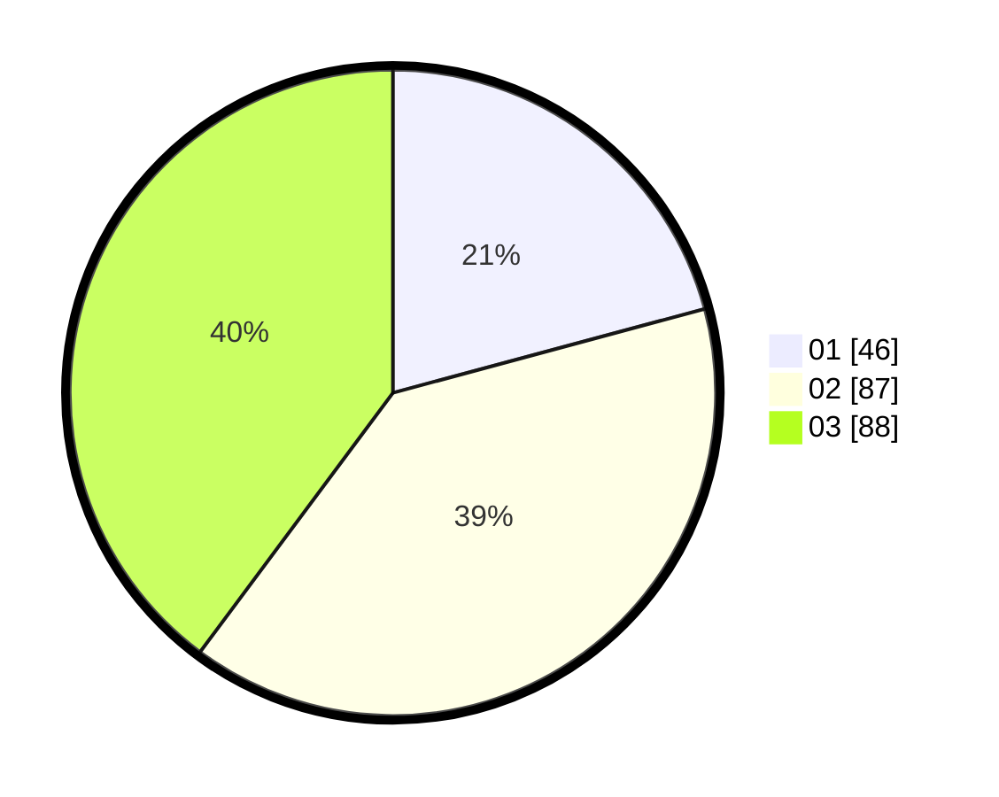

# Hasil

Hasil perolehan suara paslon dapat dilihat pada file paslon-01.txt, paslon-02.txt, dan paslon-03.txt.

Jika tidak ada, artinya data tersebut belum ada pada SIREKAP.

## Perolehan Suara

 * Paslon 01: **46**.
 * Paslon 02: **87**.
 * Paslon 03: **88**.

## Foto C Plano

https://sirekap-obj-formc.kpu.go.id/cf5e/pemilu/ppwp/31/73/07/10/05/3173071005111-20240214-224431--ebf2e51b-efdd-4759-9a6b-1b6bebd69a02.jpg

https://sirekap-obj-formc.kpu.go.id/cf5e/pemilu/ppwp/31/73/07/10/05/3173071005111-20240214-155042--005921e3-7d60-43cb-87fd-41634c239da8.jpg

https://sirekap-obj-formc.kpu.go.id/cf5e/pemilu/ppwp/31/73/07/10/05/3173071005111-20240214-224447--e6f017d0-fae9-461d-b702-f63f4f2b4727.jpg
