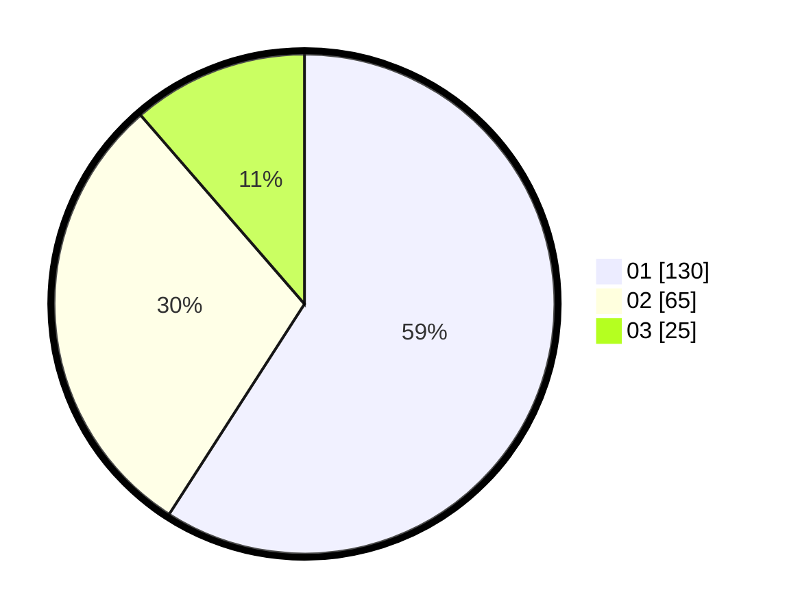

# Hasil

Hasil perolehan suara paslon dapat dilihat pada file paslon-01.txt, paslon-02.txt, dan paslon-03.txt.

Jika tidak ada, artinya data tersebut belum ada pada SIREKAP.

## Perolehan Suara

 * Paslon 01: **130**.
 * Paslon 02: **65**.
 * Paslon 03: **25**.

## Foto C Plano

https://sirekap-obj-formc.kpu.go.id/1964/pemilu/ppwp/31/73/07/10/06/3173071006002-20240214-223723--a48e93a3-72ff-4c49-8df8-aac0523afb71.jpg

https://sirekap-obj-formc.kpu.go.id/1964/pemilu/ppwp/31/73/07/10/06/3173071006002-20240214-215211--26de2b29-1c68-439d-b354-4755ce13aef3.jpg

https://sirekap-obj-formc.kpu.go.id/1964/pemilu/ppwp/31/73/07/10/06/3173071006002-20240214-215320--dd5a8c6b-9130-4a4d-a68d-8e3a3c9d7f46.jpg
