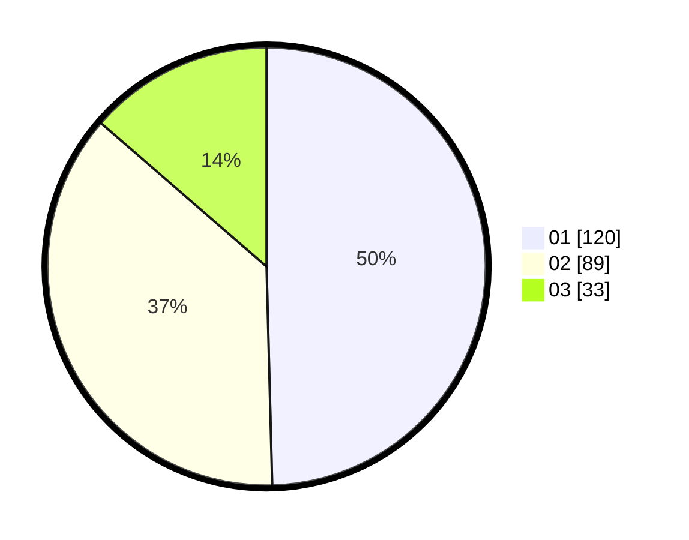

# Hasil

Hasil perolehan suara paslon dapat dilihat pada file paslon-01.txt, paslon-02.txt, dan paslon-03.txt.

Jika tidak ada, artinya data tersebut belum ada pada SIREKAP.

## Perolehan Suara

 * Paslon 01: **120**.
 * Paslon 02: **89**.
 * Paslon 03: **33**.

## Foto C Plano

https://sirekap-obj-formc.kpu.go.id/0734/pemilu/ppwp/31/73/07/10/06/3173071006005-20240214-230352--99b6b205-6a32-41aa-9ce2-b702f41957bc.jpg

https://sirekap-obj-formc.kpu.go.id/0734/pemilu/ppwp/31/73/07/10/06/3173071006005-20240214-230440--9c71e67d-959a-4470-9a82-908b9d919f0f.jpg

https://sirekap-obj-formc.kpu.go.id/0734/pemilu/ppwp/31/73/07/10/06/3173071006005-20240214-230242--4d1887fd-f19e-4487-8127-04d49fa1566f.jpg
