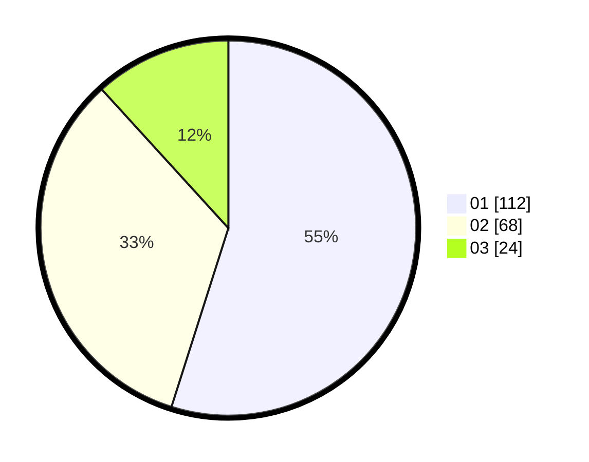

# Hasil

Hasil perolehan suara paslon dapat dilihat pada file paslon-01.txt, paslon-02.txt, dan paslon-03.txt.

Jika tidak ada, artinya data tersebut belum ada pada SIREKAP.

## Perolehan Suara

 * Paslon 01: **112**.
 * Paslon 02: **68**.
 * Paslon 03: **24**.

## Foto C Plano

https://sirekap-obj-formc.kpu.go.id/b607/pemilu/ppwp/31/73/07/10/06/3173071006006-20240214-155041--88cf93fb-c4bd-41e2-87fb-26b995683cbc.jpg

https://sirekap-obj-formc.kpu.go.id/b607/pemilu/ppwp/31/73/07/10/06/3173071006006-20240214-155346--b690f55f-404b-4960-829d-d9d94cbccd8f.jpg

https://sirekap-obj-formc.kpu.go.id/b607/pemilu/ppwp/31/73/07/10/06/3173071006006-20240214-155643--145d993c-d674-429c-b9b8-d2c33b1e9ec0.jpg

## DATA PEMILIH TETAP

Jumlah pemilih dalam DPT: **276**.
 * L: **142**.
 * P: **134**.

## DATA PENGGUNA HAK PILIH

Jumlah pengguna hak pilih dalam DPT: **211**.
 * L: **102**.
 * P: **109**.

Jumlah pengguna hak pilih dalam DPTb: **0**.
 * L: **0**.
 * P: **0**.

Jumlah pengguna hak pilih dalam DPK: **3**.
 * L: **2**.
 * P: **1**.

Jumlah pengguna hak pilih: **214**.
 * L: **104**.
 * P: **110**.

## JUMLAH SUARA SAH DAN TIDAK SAH

JUMLAH SELURUH SUARA SAH: **204**.

JUMLAH SUARA TIDAK SAH: **10**.

JUMLAH SELURUH SUARA SAH DAN SUARA TIDAK SAH: **214**.
