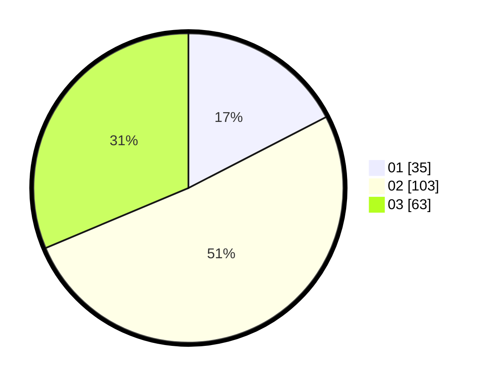

# Hasil

Hasil perolehan suara paslon dapat dilihat pada file paslon-01.txt, paslon-02.txt, dan paslon-03.txt.

Jika tidak ada, artinya data tersebut belum ada pada SIREKAP.

## Perolehan Suara

 * Paslon 01: **35**.
 * Paslon 02: **103**.
 * Paslon 03: **63**.

## Foto C Plano

https://sirekap-obj-formc.kpu.go.id/0199/pemilu/ppwp/31/73/07/10/06/3173071006011-20240214-220811--eb328368-d3b5-453f-8e2b-8d6b5d2c65bb.jpg

https://sirekap-obj-formc.kpu.go.id/0199/pemilu/ppwp/31/73/07/10/06/3173071006011-20240214-221000--81734141-585d-49f1-a23f-4bb342f04b40.jpg

https://sirekap-obj-formc.kpu.go.id/0199/pemilu/ppwp/31/73/07/10/06/3173071006011-20240214-221141--6a9a7f15-3160-4269-a7fd-d78f268f6d42.jpg
