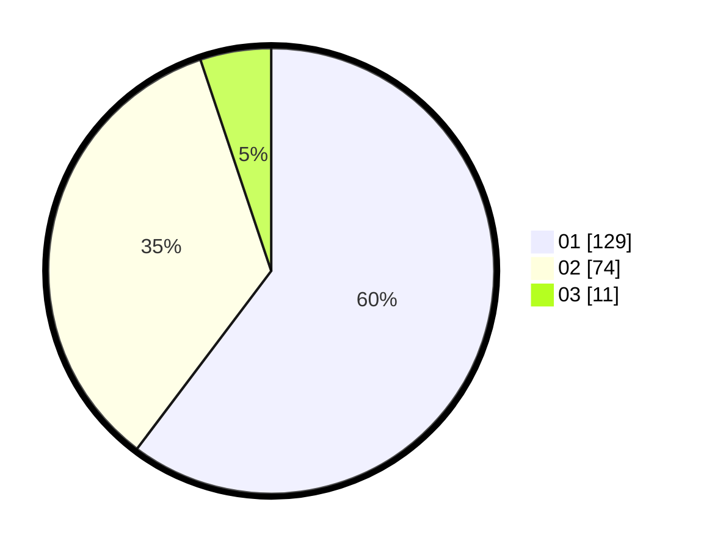

# Hasil

Hasil perolehan suara paslon dapat dilihat pada file paslon-01.txt, paslon-02.txt, dan paslon-03.txt.

Jika tidak ada, artinya data tersebut belum ada pada SIREKAP.

## Perolehan Suara

 * Paslon 01: **129**.
 * Paslon 02: **74**.
 * Paslon 03: **11**.

## Foto C Plano

https://sirekap-obj-formc.kpu.go.id/c133/pemilu/ppwp/31/73/07/10/06/3173071006014-20240214-215723--08a0ca6e-f57e-452d-bdc2-904771a59069.jpg

https://sirekap-obj-formc.kpu.go.id/c133/pemilu/ppwp/31/73/07/10/06/3173071006014-20240214-215815--9b41129b-457c-4200-a523-e2c4131ab82a.jpg

https://sirekap-obj-formc.kpu.go.id/c133/pemilu/ppwp/31/73/07/10/06/3173071006014-20240214-215904--d174e4bf-c74f-43ed-a4cd-47b181fb3d14.jpg
