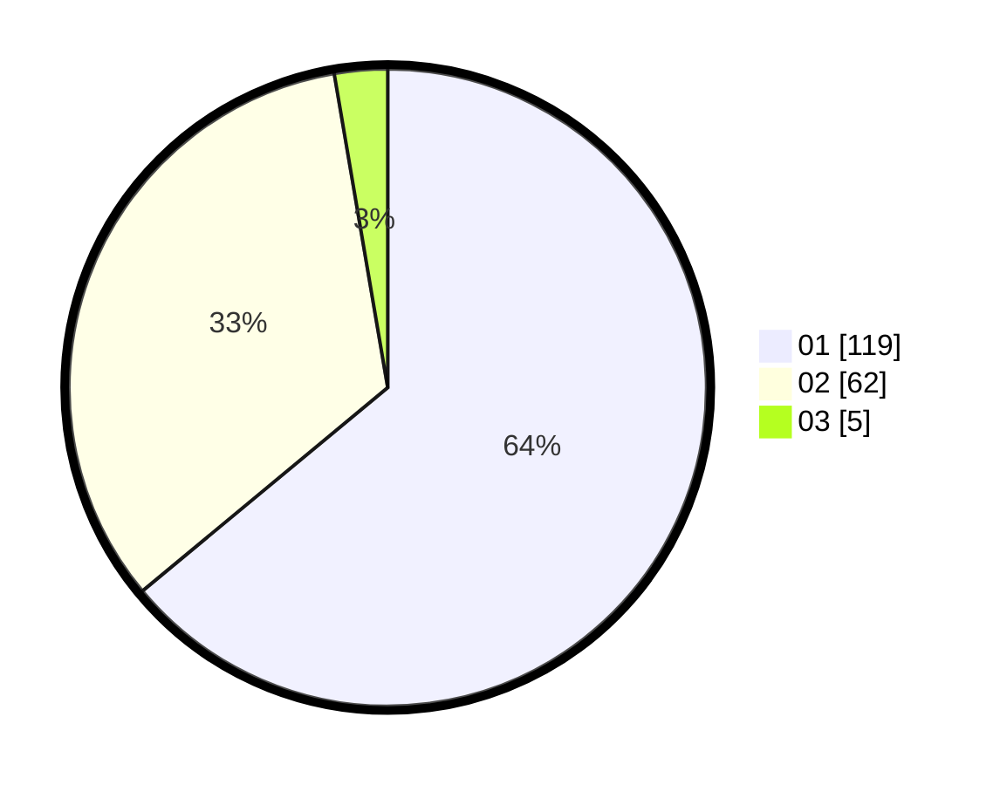

# Hasil

Hasil perolehan suara paslon dapat dilihat pada file paslon-01.txt, paslon-02.txt, dan paslon-03.txt.

Jika tidak ada, artinya data tersebut belum ada pada SIREKAP.

## Perolehan Suara

 * Paslon 01: **119**.
 * Paslon 02: **62**.
 * Paslon 03: **5**.

## Foto C Plano

https://sirekap-obj-formc.kpu.go.id/4d42/pemilu/ppwp/31/73/07/10/06/3173071006020-20240214-192840--5545123f-acbf-4908-a803-0b78b678de1d.jpg

https://sirekap-obj-formc.kpu.go.id/4d42/pemilu/ppwp/31/73/07/10/06/3173071006020-20240214-193055--ab8b07e6-42cb-428c-9e4a-f2fc4f37bcc4.jpg

https://sirekap-obj-formc.kpu.go.id/4d42/pemilu/ppwp/31/73/07/10/06/3173071006020-20240214-194143--0034a44b-47e0-4fc4-b97b-cc709325c31f.jpg

## DATA PEMILIH TETAP

Jumlah pemilih dalam DPT: **264**.
 * L: **134**.
 * P: **130**.

## DATA PENGGUNA HAK PILIH

Jumlah pengguna hak pilih dalam DPT: **194**.
 * L: **95**.
 * P: **99**.

Jumlah pengguna hak pilih dalam DPTb: **0**.
 * L: **0**.
 * P: **0**.

Jumlah pengguna hak pilih dalam DPK: **0**.
 * L: **0**.
 * P: **0**.

Jumlah pengguna hak pilih: **194**.
 * L: **95**.
 * P: **99**.

## JUMLAH SUARA SAH DAN TIDAK SAH

JUMLAH SELURUH SUARA SAH: **186**.

JUMLAH SUARA TIDAK SAH: **8**.

JUMLAH SELURUH SUARA SAH DAN SUARA TIDAK SAH: **194**.
