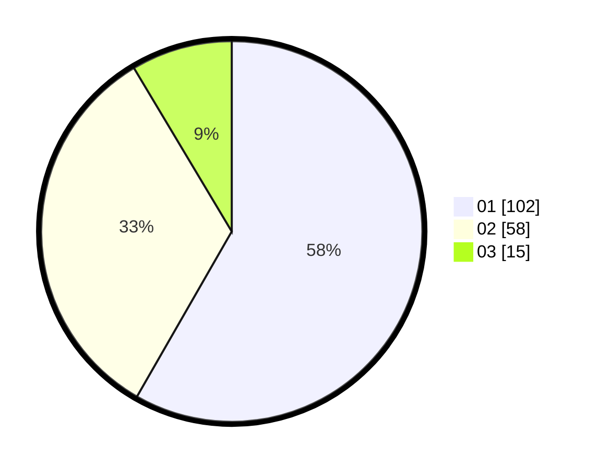

# Hasil

Hasil perolehan suara paslon dapat dilihat pada file paslon-01.txt, paslon-02.txt, dan paslon-03.txt.

Jika tidak ada, artinya data tersebut belum ada pada SIREKAP.

## Perolehan Suara

 * Paslon 01: **102**.
 * Paslon 02: **58**.
 * Paslon 03: **15**.

## Foto C Plano

https://sirekap-obj-formc.kpu.go.id/2d08/pemilu/ppwp/31/73/07/10/06/3173071006029-20240214-230110--1f5f3369-7d47-42e7-b2ea-af2c8c3e5667.jpg

https://sirekap-obj-formc.kpu.go.id/2d08/pemilu/ppwp/31/73/07/10/06/3173071006029-20240214-211600--de908d80-60a1-4e0b-b214-330faef3bb30.jpg

https://sirekap-obj-formc.kpu.go.id/2d08/pemilu/ppwp/31/73/07/10/06/3173071006029-20240214-212538--da8113ba-65c2-443e-b004-5a0a604a6318.jpg
