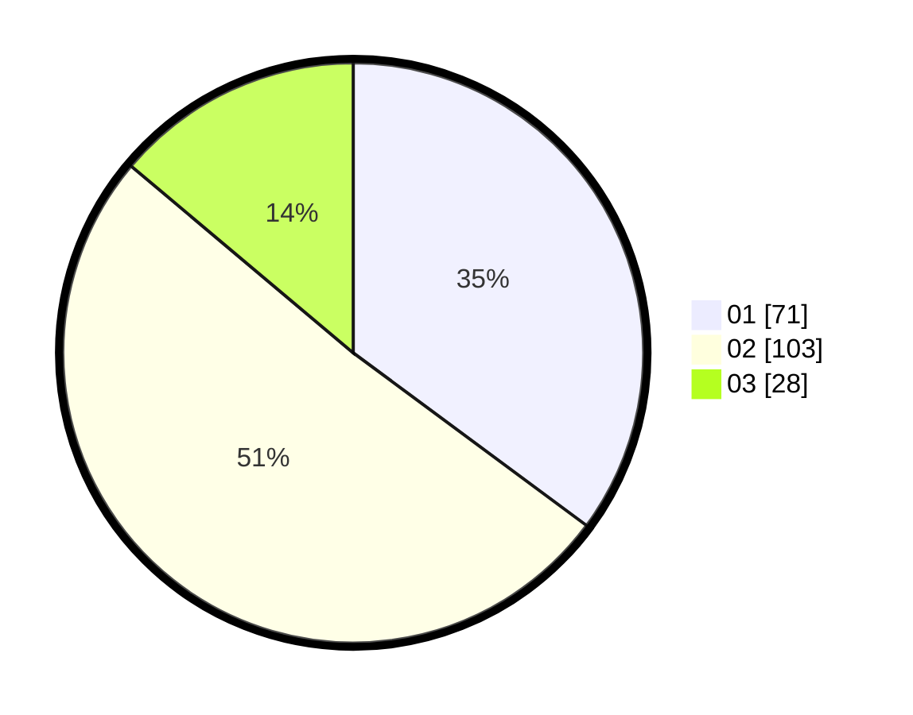

# Hasil

Hasil perolehan suara paslon dapat dilihat pada file paslon-01.txt, paslon-02.txt, dan paslon-03.txt.

Jika tidak ada, artinya data tersebut belum ada pada SIREKAP.

## Perolehan Suara

 * Paslon 01: **71**.
 * Paslon 02: **103**.
 * Paslon 03: **28**.

## Foto C Plano

https://sirekap-obj-formc.kpu.go.id/a26d/pemilu/ppwp/31/73/07/10/06/3173071006036-20240214-192326--473415ae-95ef-4591-afb2-7da8ec61d30f.jpg

https://sirekap-obj-formc.kpu.go.id/a26d/pemilu/ppwp/31/73/07/10/06/3173071006036-20240214-192418--a99137f9-2d86-4c3e-ad96-0303ccab2bf4.jpg
