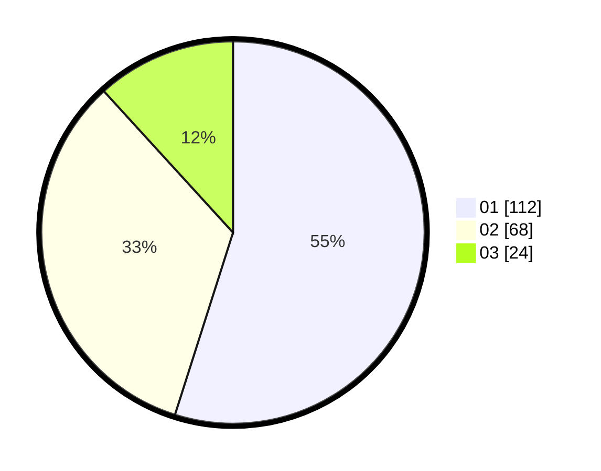

# Hasil

Hasil perolehan suara paslon dapat dilihat pada file paslon-01.txt, paslon-02.txt, dan paslon-03.txt.

Jika tidak ada, artinya data tersebut belum ada pada SIREKAP.

## Perolehan Suara

 * Paslon 01: **112**.
 * Paslon 02: **68**.
 * Paslon 03: **24**.

## Foto C Plano

https://sirekap-obj-formc.kpu.go.id/d1a0/pemilu/ppwp/31/73/07/10/06/3173071006039-20240214-155319--23700e32-6cd3-41ba-a97e-1e5af72cb589.jpg

https://sirekap-obj-formc.kpu.go.id/d1a0/pemilu/ppwp/31/73/07/10/06/3173071006039-20240214-155352--bae8d8de-b57e-4706-99f3-c108ef005738.jpg

https://sirekap-obj-formc.kpu.go.id/d1a0/pemilu/ppwp/31/73/07/10/06/3173071006039-20240214-155421--b6918038-df2f-46ef-b0db-9267a18ce21a.jpg

## DATA PEMILIH TETAP

Jumlah pemilih dalam DPT: **241**.
 * L: **123**.
 * P: **118**.

## DATA PENGGUNA HAK PILIH

Jumlah pengguna hak pilih dalam DPT: **209**.
 * L: **104**.
 * P: **105**.

Jumlah pengguna hak pilih dalam DPTb: **1**.
 * L: **1**.
 * P: **0**.

Jumlah pengguna hak pilih dalam DPK: **0**.
 * L: **0**.
 * P: **0**.

Jumlah pengguna hak pilih: **210**.
 * L: **105**.
 * P: **105**.

## JUMLAH SUARA SAH DAN TIDAK SAH

JUMLAH SELURUH SUARA SAH: **204**.

JUMLAH SUARA TIDAK SAH: **6**.

JUMLAH SELURUH SUARA SAH DAN SUARA TIDAK SAH: **210**.
