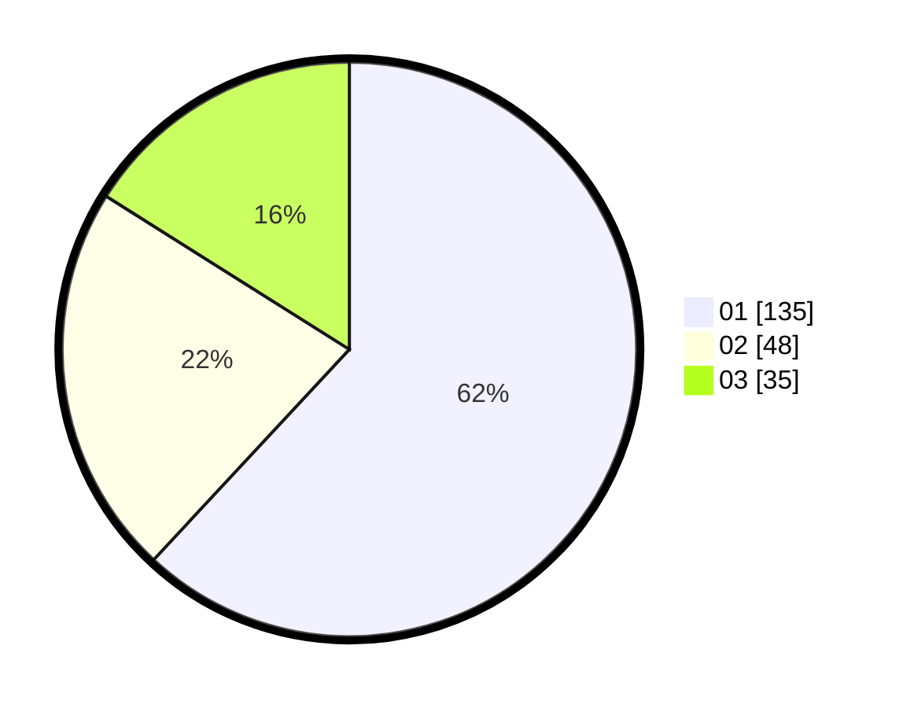

# Hasil

Hasil perolehan suara paslon dapat dilihat pada file paslon-01.txt, paslon-02.txt, dan paslon-03.txt.

Jika tidak ada, artinya data tersebut belum ada pada SIREKAP.

## Perolehan Suara

 * Paslon 01: **135**.
 * Paslon 02: **48**.
 * Paslon 03: **35**.

## Foto C Plano

https://sirekap-obj-formc.kpu.go.id/5846/pemilu/ppwp/31/73/07/10/06/3173071006045-20240214-194559--317b087c-cb93-4a1b-9160-8545c98c930c.jpg

https://sirekap-obj-formc.kpu.go.id/5846/pemilu/ppwp/31/73/07/10/06/3173071006045-20240214-194722--71500c93-e869-4001-b350-f411dd1f6fc3.jpg

https://sirekap-obj-formc.kpu.go.id/5846/pemilu/ppwp/31/73/07/10/06/3173071006045-20240214-194832--03b8284c-012c-4e84-a726-77a61e181e1b.jpg

## DATA PEMILIH TETAP

Jumlah pemilih dalam DPT: **249**.
 * L: **126**.
 * P: **123**.

## DATA PENGGUNA HAK PILIH

Jumlah pengguna hak pilih dalam DPT: **205**.
 * L: **102**.
 * P: **103**.

Jumlah pengguna hak pilih dalam DPTb: **18**.
 * L: **4**.
 * P: **14**.

Jumlah pengguna hak pilih dalam DPK: **0**.
 * L: **0**.
 * P: **0**.

Jumlah pengguna hak pilih: **223**.
 * L: **106**.
 * P: **117**.

## JUMLAH SUARA SAH DAN TIDAK SAH

JUMLAH SELURUH SUARA SAH: **218**.

JUMLAH SUARA TIDAK SAH: **5**.

JUMLAH SELURUH SUARA SAH DAN SUARA TIDAK SAH: **223**.
