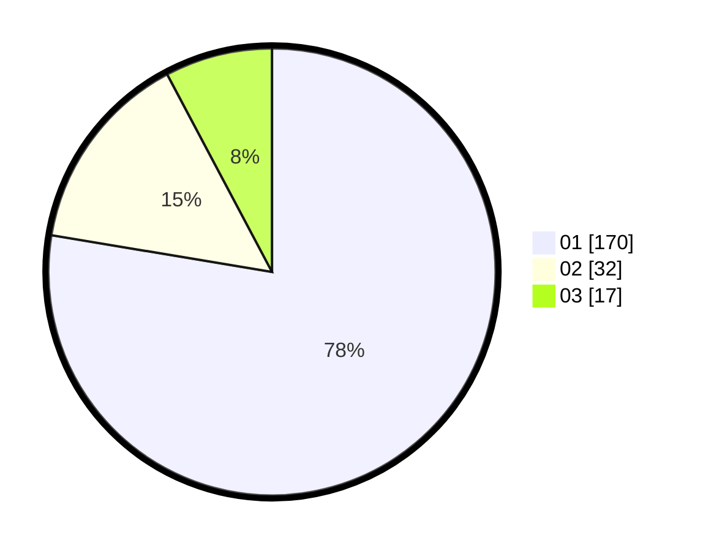

# Hasil

Hasil perolehan suara paslon dapat dilihat pada file paslon-01.txt, paslon-02.txt, dan paslon-03.txt.

Jika tidak ada, artinya data tersebut belum ada pada SIREKAP.

## Perolehan Suara

 * Paslon 01: **170**.
 * Paslon 02: **32**.
 * Paslon 03: **17**.

## Foto C Plano

https://sirekap-obj-formc.kpu.go.id/f718/pemilu/ppwp/31/73/07/10/06/3173071006046-20240214-195439--e75c36d5-d700-4e7a-b1fc-042d0eb8e924.jpg

https://sirekap-obj-formc.kpu.go.id/f718/pemilu/ppwp/31/73/07/10/06/3173071006046-20240215-072150--adf7b23c-df14-4f65-be7d-bbd090ca3a1d.jpg

https://sirekap-obj-formc.kpu.go.id/f718/pemilu/ppwp/31/73/07/10/06/3173071006046-20240214-195519--84d3c813-f2f4-4a84-b65a-5f6813b5bb1e.jpg

## DATA PEMILIH TETAP

Jumlah pemilih dalam DPT: **231**.
 * L: **104**.
 * P: **127**.

## DATA PENGGUNA HAK PILIH

Jumlah pengguna hak pilih dalam DPT: **198**.
 * L: **97**.
 * P: **101**.

Jumlah pengguna hak pilih dalam DPTb: **12**.
 * L: **2**.
 * P: **10**.

Jumlah pengguna hak pilih dalam DPK: **9**.
 * L: **7**.
 * P: **2**.

Jumlah pengguna hak pilih: **219**.
 * L: **106**.
 * P: **113**.

## JUMLAH SUARA SAH DAN TIDAK SAH

JUMLAH SELURUH SUARA SAH: **219**.

JUMLAH SUARA TIDAK SAH: **0**.

JUMLAH SELURUH SUARA SAH DAN SUARA TIDAK SAH: **219**.
