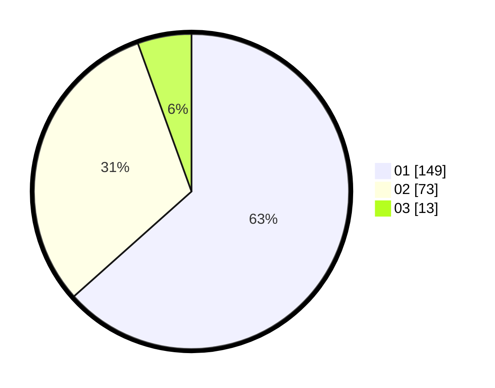

# Hasil

Hasil perolehan suara paslon dapat dilihat pada file paslon-01.txt, paslon-02.txt, dan paslon-03.txt.

Jika tidak ada, artinya data tersebut belum ada pada SIREKAP.

## Perolehan Suara

 * Paslon 01: **149**.
 * Paslon 02: **73**.
 * Paslon 03: **13**.

## Foto C Plano

https://sirekap-obj-formc.kpu.go.id/4c28/pemilu/ppwp/31/73/07/10/06/3173071006048-20240214-201613--d579e6bc-283d-40c3-85af-9dbd362f3619.jpg

https://sirekap-obj-formc.kpu.go.id/4c28/pemilu/ppwp/31/73/07/10/06/3173071006048-20240214-201513--31bb780a-86f6-4a9c-9404-69249996e2e5.jpg

https://sirekap-obj-formc.kpu.go.id/4c28/pemilu/ppwp/31/73/07/10/06/3173071006048-20240214-201412--9c0a1a75-3e63-438d-a2de-8db61a4f64cc.jpg

## DATA PEMILIH TETAP

Jumlah pemilih dalam DPT: **289**.
 * L: **134**.
 * P: **155**.

## DATA PENGGUNA HAK PILIH

Jumlah pengguna hak pilih dalam DPT: **215**.
 * L: **105**.
 * P: **110**.

Jumlah pengguna hak pilih dalam DPTb: **23**.
 * L: **13**.
 * P: **10**.

Jumlah pengguna hak pilih dalam DPK: **0**.
 * L: **0**.
 * P: **0**.

Jumlah pengguna hak pilih: **238**.
 * L: **118**.
 * P: **120**.

## JUMLAH SUARA SAH DAN TIDAK SAH

JUMLAH SELURUH SUARA SAH: **235**.

JUMLAH SUARA TIDAK SAH: **3**.

JUMLAH SELURUH SUARA SAH DAN SUARA TIDAK SAH: **238**.
