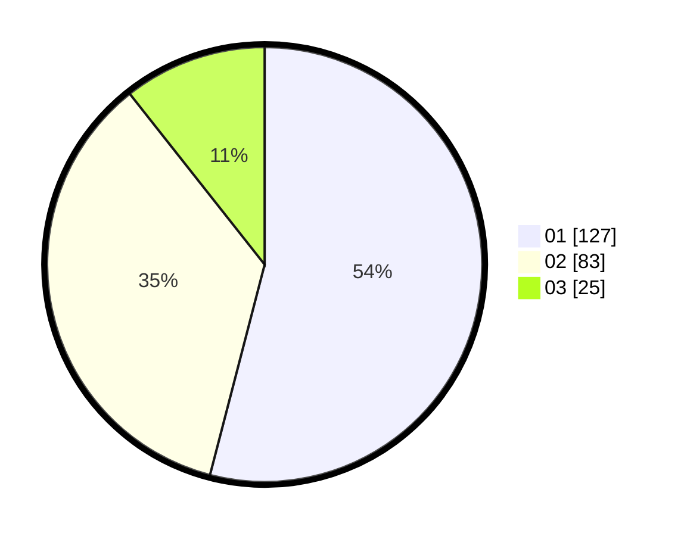

# Hasil

Hasil perolehan suara paslon dapat dilihat pada file paslon-01.txt, paslon-02.txt, dan paslon-03.txt.

Jika tidak ada, artinya data tersebut belum ada pada SIREKAP.

## Perolehan Suara

 * Paslon 01: **127**.
 * Paslon 02: **83**.
 * Paslon 03: **25**.

## Foto C Plano

https://sirekap-obj-formc.kpu.go.id/b855/pemilu/ppwp/31/73/07/10/06/3173071006055-20240214-201611--fe8ef308-e40c-42c8-811f-6dd3e38176a6.jpg

https://sirekap-obj-formc.kpu.go.id/b855/pemilu/ppwp/31/73/07/10/06/3173071006055-20240214-195830--bb2113e7-b124-433f-b923-04ce5f1b0d69.jpg

https://sirekap-obj-formc.kpu.go.id/b855/pemilu/ppwp/31/73/07/10/06/3173071006055-20240214-201906--febfd46e-e4fd-4c99-b32d-621eb9abe7b3.jpg
