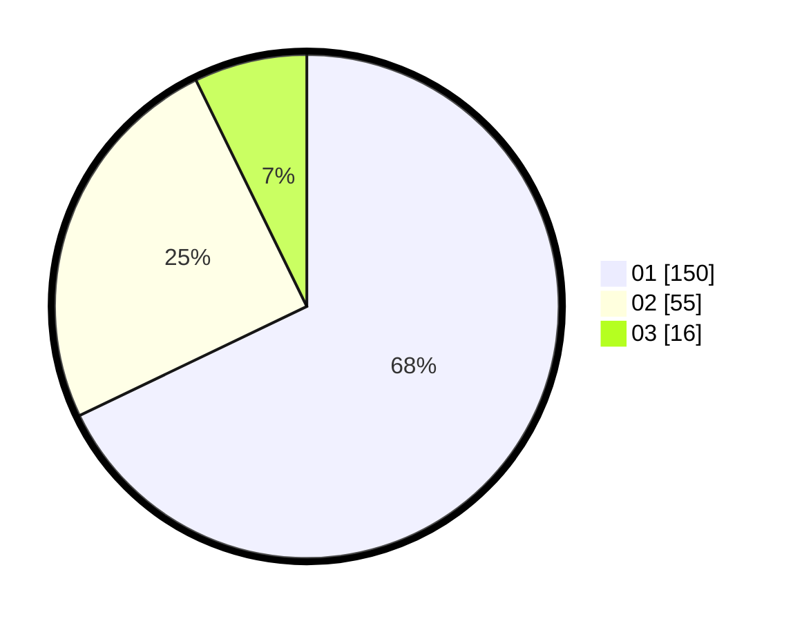

# Hasil

Hasil perolehan suara paslon dapat dilihat pada file paslon-01.txt, paslon-02.txt, dan paslon-03.txt.

Jika tidak ada, artinya data tersebut belum ada pada SIREKAP.

## Perolehan Suara

 * Paslon 01: **150**.
 * Paslon 02: **55**.
 * Paslon 03: **16**.

## Foto C Plano

https://sirekap-obj-formc.kpu.go.id/81a5/pemilu/ppwp/31/73/07/10/06/3173071006056-20240215-005826--c69469c5-ae71-425d-863b-72d7cd26828b.jpg

https://sirekap-obj-formc.kpu.go.id/81a5/pemilu/ppwp/31/73/07/10/06/3173071006056-20240214-155439--d8b998fa-5f55-4c01-a9f0-2c954a1d0eef.jpg

https://sirekap-obj-formc.kpu.go.id/81a5/pemilu/ppwp/31/73/07/10/06/3173071006056-20240214-192305--7d8ade1d-e82f-4b10-a3fd-a3abc89e9866.jpg
