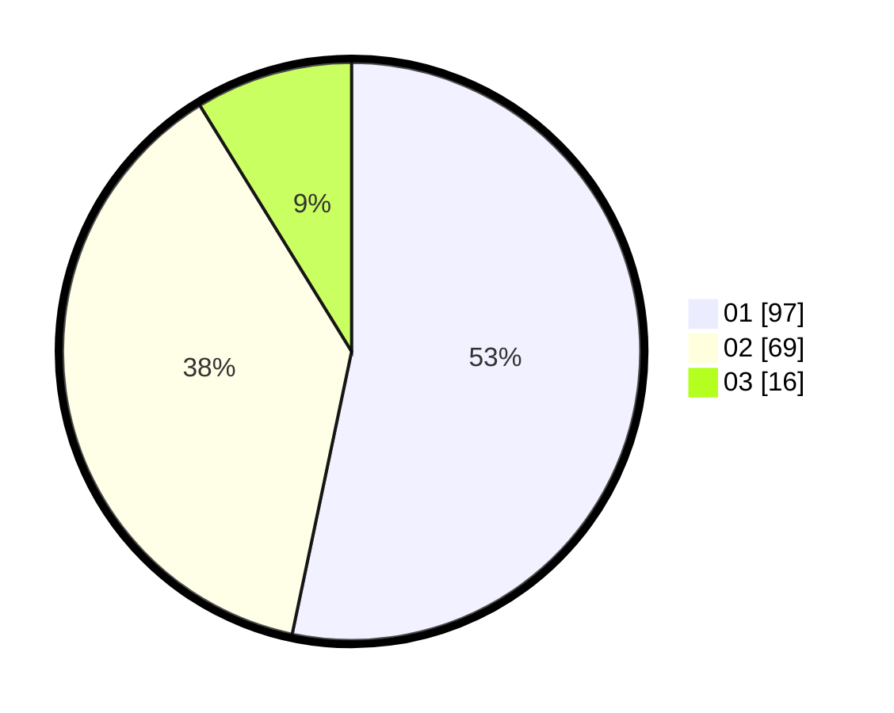

# Hasil

Hasil perolehan suara paslon dapat dilihat pada file paslon-01.txt, paslon-02.txt, dan paslon-03.txt.

Jika tidak ada, artinya data tersebut belum ada pada SIREKAP.

## Perolehan Suara

 * Paslon 01: **97**.
 * Paslon 02: **69**.
 * Paslon 03: **16**.

## Foto C Plano

https://sirekap-obj-formc.kpu.go.id/7f0f/pemilu/ppwp/31/73/07/10/06/3173071006065-20240214-214450--c5a504ec-8a86-480a-963c-17da0da44961.jpg

https://sirekap-obj-formc.kpu.go.id/7f0f/pemilu/ppwp/31/73/07/10/06/3173071006065-20240214-214649--48d92d14-2e27-4887-a4a8-ebef6e9bef8d.jpg

https://sirekap-obj-formc.kpu.go.id/7f0f/pemilu/ppwp/31/73/07/10/06/3173071006065-20240214-214821--4575c533-06b7-4edc-825e-e956db807778.jpg

## DATA PEMILIH TETAP

Jumlah pemilih dalam DPT: **230**.
 * L: **120**.
 * P: **110**.

## DATA PENGGUNA HAK PILIH

Jumlah pengguna hak pilih dalam DPT: **172**.
 * L: **86**.
 * P: **86**.

Jumlah pengguna hak pilih dalam DPTb: **13**.
 * L: **6**.
 * P: **7**.

Jumlah pengguna hak pilih dalam DPK: **0**.
 * L: **0**.
 * P: **0**.

Jumlah pengguna hak pilih: **185**.
 * L: **92**.
 * P: **93**.

## JUMLAH SUARA SAH DAN TIDAK SAH

JUMLAH SELURUH SUARA SAH: **182**.

JUMLAH SUARA TIDAK SAH: **3**.

JUMLAH SELURUH SUARA SAH DAN SUARA TIDAK SAH: **185**.
