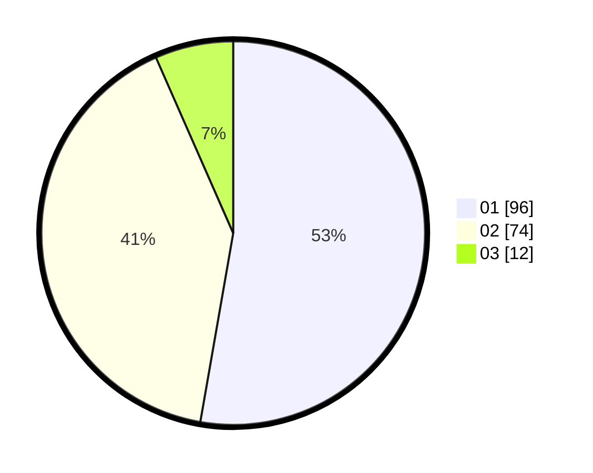

# Hasil

Hasil perolehan suara paslon dapat dilihat pada file paslon-01.txt, paslon-02.txt, dan paslon-03.txt.

Jika tidak ada, artinya data tersebut belum ada pada SIREKAP.

## Perolehan Suara

 * Paslon 01: **96**.
 * Paslon 02: **74**.
 * Paslon 03: **12**.

## Foto C Plano

https://sirekap-obj-formc.kpu.go.id/67e4/pemilu/ppwp/31/73/07/10/06/3173071006074-20240214-230145--c9867846-3d9d-425c-94b2-91e203219aa3.jpg

https://sirekap-obj-formc.kpu.go.id/67e4/pemilu/ppwp/31/73/07/10/06/3173071006074-20240214-212815--f99939dc-bbd0-4ebe-a2b9-1a58e1dc97c6.jpg

https://sirekap-obj-formc.kpu.go.id/67e4/pemilu/ppwp/31/73/07/10/06/3173071006074-20240214-230419--04822f30-989a-4377-852a-db0e6876ee46.jpg
