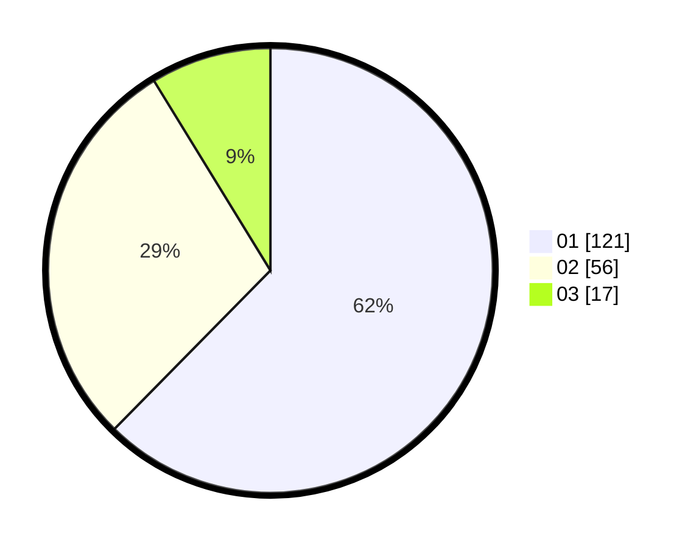

# Hasil

Hasil perolehan suara paslon dapat dilihat pada file paslon-01.txt, paslon-02.txt, dan paslon-03.txt.

Jika tidak ada, artinya data tersebut belum ada pada SIREKAP.

## Perolehan Suara

 * Paslon 01: **121**.
 * Paslon 02: **56**.
 * Paslon 03: **17**.

## Foto C Plano

https://sirekap-obj-formc.kpu.go.id/6c52/pemilu/ppwp/31/73/07/10/06/3173071006076-20240214-192323--556fc098-2cc3-4a14-baaa-73fe74a22621.jpg

https://sirekap-obj-formc.kpu.go.id/6c52/pemilu/ppwp/31/73/07/10/06/3173071006076-20240214-192824--e8d9f599-4366-44fb-bb7c-4eb3d7265afd.jpg

https://sirekap-obj-formc.kpu.go.id/6c52/pemilu/ppwp/31/73/07/10/06/3173071006076-20240214-192907--66db9e01-0865-466a-8b6a-0497e5214ddd.jpg

## DATA PEMILIH TETAP

Jumlah pemilih dalam DPT: **196**.
 * L: **91**.
 * P: **105**.

## DATA PENGGUNA HAK PILIH

Jumlah pengguna hak pilih dalam DPT: **182**.
 * L: **88**.
 * P: **94**.

Jumlah pengguna hak pilih dalam DPTb: **13**.
 * L: **3**.
 * P: **10**.

Jumlah pengguna hak pilih dalam DPK: **0**.
 * L: **0**.
 * P: **0**.

Jumlah pengguna hak pilih: **195**.
 * L: **91**.
 * P: **104**.

## JUMLAH SUARA SAH DAN TIDAK SAH

JUMLAH SELURUH SUARA SAH: **194**.

JUMLAH SUARA TIDAK SAH: **2**.

JUMLAH SELURUH SUARA SAH DAN SUARA TIDAK SAH: **196**.
